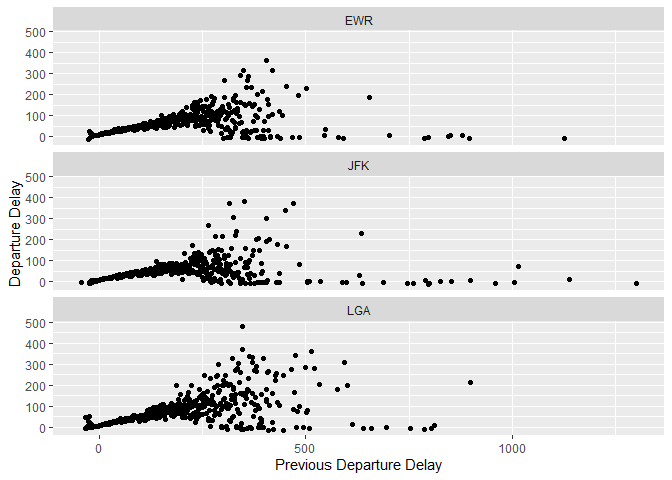
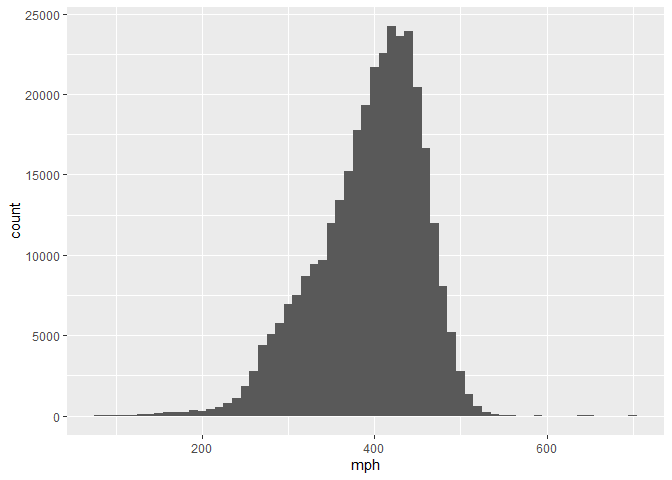

Tarea 3 \[Actividad grupal\]: dplyr
================
Velasquez_Fernandez_Benjy&Morante_Suarez_Diego
14/1/2022

# EJERCICIOS: tidyverse

install.packages(“nycflights13”) install.packages(“ggplot2”)

``` r
library(ggplot2)
library(nycflights13)
library(dplyr)
```

    ## 
    ## Attaching package: 'dplyr'

    ## The following objects are masked from 'package:stats':
    ## 
    ##     filter, lag

    ## The following objects are masked from 'package:base':
    ## 
    ##     intersect, setdiff, setequal, union

``` r
glimpse(flights)#columns run down the page, and data runs across.
```

    ## Rows: 336,776
    ## Columns: 19
    ## $ year           <int> 2013, 2013, 2013, 2013, 2013, 2013, 2013, 2013, 2013, 2~
    ## $ month          <int> 1, 1, 1, 1, 1, 1, 1, 1, 1, 1, 1, 1, 1, 1, 1, 1, 1, 1, 1~
    ## $ day            <int> 1, 1, 1, 1, 1, 1, 1, 1, 1, 1, 1, 1, 1, 1, 1, 1, 1, 1, 1~
    ## $ dep_time       <int> 517, 533, 542, 544, 554, 554, 555, 557, 557, 558, 558, ~
    ## $ sched_dep_time <int> 515, 529, 540, 545, 600, 558, 600, 600, 600, 600, 600, ~
    ## $ dep_delay      <dbl> 2, 4, 2, -1, -6, -4, -5, -3, -3, -2, -2, -2, -2, -2, -1~
    ## $ arr_time       <int> 830, 850, 923, 1004, 812, 740, 913, 709, 838, 753, 849,~
    ## $ sched_arr_time <int> 819, 830, 850, 1022, 837, 728, 854, 723, 846, 745, 851,~
    ## $ arr_delay      <dbl> 11, 20, 33, -18, -25, 12, 19, -14, -8, 8, -2, -3, 7, -1~
    ## $ carrier        <chr> "UA", "UA", "AA", "B6", "DL", "UA", "B6", "EV", "B6", "~
    ## $ flight         <int> 1545, 1714, 1141, 725, 461, 1696, 507, 5708, 79, 301, 4~
    ## $ tailnum        <chr> "N14228", "N24211", "N619AA", "N804JB", "N668DN", "N394~
    ## $ origin         <chr> "EWR", "LGA", "JFK", "JFK", "LGA", "EWR", "EWR", "LGA",~
    ## $ dest           <chr> "IAH", "IAH", "MIA", "BQN", "ATL", "ORD", "FLL", "IAD",~
    ## $ air_time       <dbl> 227, 227, 160, 183, 116, 150, 158, 53, 140, 138, 149, 1~
    ## $ distance       <dbl> 1400, 1416, 1089, 1576, 762, 719, 1065, 229, 944, 733, ~
    ## $ hour           <dbl> 5, 5, 5, 5, 6, 5, 6, 6, 6, 6, 6, 6, 6, 6, 6, 5, 6, 6, 6~
    ## $ minute         <dbl> 15, 29, 40, 45, 0, 58, 0, 0, 0, 0, 0, 0, 0, 0, 0, 59, 0~
    ## $ time_hour      <dttm> 2013-01-01 05:00:00, 2013-01-01 05:00:00, 2013-01-01 0~

# Parte 1: Dplyr - filter

1.Encuentra todos los vuelos que: a)Tuvieron un retraso de llegada de
dos o mas horas

``` r
data("flights")
flights <- flights
vuelos_retraso <- filter(flights,arr_delay >= 120)
head(vuelos_retraso,10)
```

    ## # A tibble: 10 x 19
    ##     year month   day dep_time sched_dep_time dep_delay arr_time sched_arr_time
    ##    <int> <int> <int>    <int>          <int>     <dbl>    <int>          <int>
    ##  1  2013     1     1      811            630       101     1047            830
    ##  2  2013     1     1      848           1835       853     1001           1950
    ##  3  2013     1     1      957            733       144     1056            853
    ##  4  2013     1     1     1114            900       134     1447           1222
    ##  5  2013     1     1     1505           1310       115     1638           1431
    ##  6  2013     1     1     1525           1340       105     1831           1626
    ##  7  2013     1     1     1549           1445        64     1912           1656
    ##  8  2013     1     1     1558           1359       119     1718           1515
    ##  9  2013     1     1     1732           1630        62     2028           1825
    ## 10  2013     1     1     1803           1620       103     2008           1750
    ## # ... with 11 more variables: arr_delay <dbl>, carrier <chr>, flight <int>,
    ## #   tailnum <chr>, origin <chr>, dest <chr>, air_time <dbl>, distance <dbl>,
    ## #   hour <dbl>, minute <dbl>, time_hour <dttm>

``` r
cantidad_vuelos_retraso <- count(vuelos_retraso)
cantidad_vuelos_retraso
```

    ## # A tibble: 1 x 1
    ##       n
    ##   <int>
    ## 1 10200

Por lo tanto, huvieron 10200 vuelos retrasados

b)Volaron a Houston (IAH o HOU)

``` r
b <- filter(flights,dest %in% c("IAH","HOU"))
count(b)
```

    ## # A tibble: 1 x 1
    ##       n
    ##   <int>
    ## 1  9313

``` r
b
```

    ## # A tibble: 9,313 x 19
    ##     year month   day dep_time sched_dep_time dep_delay arr_time sched_arr_time
    ##    <int> <int> <int>    <int>          <int>     <dbl>    <int>          <int>
    ##  1  2013     1     1      517            515         2      830            819
    ##  2  2013     1     1      533            529         4      850            830
    ##  3  2013     1     1      623            627        -4      933            932
    ##  4  2013     1     1      728            732        -4     1041           1038
    ##  5  2013     1     1      739            739         0     1104           1038
    ##  6  2013     1     1      908            908         0     1228           1219
    ##  7  2013     1     1     1028           1026         2     1350           1339
    ##  8  2013     1     1     1044           1045        -1     1352           1351
    ##  9  2013     1     1     1114            900       134     1447           1222
    ## 10  2013     1     1     1205           1200         5     1503           1505
    ## # ... with 9,303 more rows, and 11 more variables: arr_delay <dbl>,
    ## #   carrier <chr>, flight <int>, tailnum <chr>, origin <chr>, dest <chr>,
    ## #   air_time <dbl>, distance <dbl>, hour <dbl>, minute <dbl>, time_hour <dttm>

Por lo tanto 9313 viajaron a Houston c)Fueron operados por United,
American o Delta

``` r
c <- filter(flights,carrier %in% c("UA", "AA", "DL"))
count(c)
```

    ## # A tibble: 1 x 1
    ##        n
    ##    <int>
    ## 1 139504

``` r
c
```

    ## # A tibble: 139,504 x 19
    ##     year month   day dep_time sched_dep_time dep_delay arr_time sched_arr_time
    ##    <int> <int> <int>    <int>          <int>     <dbl>    <int>          <int>
    ##  1  2013     1     1      517            515         2      830            819
    ##  2  2013     1     1      533            529         4      850            830
    ##  3  2013     1     1      542            540         2      923            850
    ##  4  2013     1     1      554            600        -6      812            837
    ##  5  2013     1     1      554            558        -4      740            728
    ##  6  2013     1     1      558            600        -2      753            745
    ##  7  2013     1     1      558            600        -2      924            917
    ##  8  2013     1     1      558            600        -2      923            937
    ##  9  2013     1     1      559            600        -1      941            910
    ## 10  2013     1     1      559            600        -1      854            902
    ## # ... with 139,494 more rows, and 11 more variables: arr_delay <dbl>,
    ## #   carrier <chr>, flight <int>, tailnum <chr>, origin <chr>, dest <chr>,
    ## #   air_time <dbl>, distance <dbl>, hour <dbl>, minute <dbl>, time_hour <dttm>

Por lo tanto 139504 fueron operados por United, American o Delta
d)Partieron en invierno del hemisferio sur (julio, agosto y septiembre)

``` r
d <- filter(flights,month %in% c(7, 8, 9))
count(d)
```

    ## # A tibble: 1 x 1
    ##       n
    ##   <int>
    ## 1 86326

``` r
d
```

    ## # A tibble: 86,326 x 19
    ##     year month   day dep_time sched_dep_time dep_delay arr_time sched_arr_time
    ##    <int> <int> <int>    <int>          <int>     <dbl>    <int>          <int>
    ##  1  2013     7     1        1           2029       212      236           2359
    ##  2  2013     7     1        2           2359         3      344            344
    ##  3  2013     7     1       29           2245       104      151              1
    ##  4  2013     7     1       43           2130       193      322             14
    ##  5  2013     7     1       44           2150       174      300            100
    ##  6  2013     7     1       46           2051       235      304           2358
    ##  7  2013     7     1       48           2001       287      308           2305
    ##  8  2013     7     1       58           2155       183      335             43
    ##  9  2013     7     1      100           2146       194      327             30
    ## 10  2013     7     1      100           2245       135      337            135
    ## # ... with 86,316 more rows, and 11 more variables: arr_delay <dbl>,
    ## #   carrier <chr>, flight <int>, tailnum <chr>, origin <chr>, dest <chr>,
    ## #   air_time <dbl>, distance <dbl>, hour <dbl>, minute <dbl>, time_hour <dttm>

Por lo tanto 86326 partieron en invierno del hemisferio sur e)Llegaron
más de dos horas tarde, pero no salieron tarde

``` r
e <- filter(flights, dep_delay <= 0 & arr_delay > 120)
count(e)
```

    ## # A tibble: 1 x 1
    ##       n
    ##   <int>
    ## 1    29

``` r
e
```

    ## # A tibble: 29 x 19
    ##     year month   day dep_time sched_dep_time dep_delay arr_time sched_arr_time
    ##    <int> <int> <int>    <int>          <int>     <dbl>    <int>          <int>
    ##  1  2013     1    27     1419           1420        -1     1754           1550
    ##  2  2013    10     7     1350           1350         0     1736           1526
    ##  3  2013    10     7     1357           1359        -2     1858           1654
    ##  4  2013    10    16      657            700        -3     1258           1056
    ##  5  2013    11     1      658            700        -2     1329           1015
    ##  6  2013     3    18     1844           1847        -3       39           2219
    ##  7  2013     4    17     1635           1640        -5     2049           1845
    ##  8  2013     4    18      558            600        -2     1149            850
    ##  9  2013     4    18      655            700        -5     1213            950
    ## 10  2013     5    22     1827           1830        -3     2217           2010
    ## # ... with 19 more rows, and 11 more variables: arr_delay <dbl>, carrier <chr>,
    ## #   flight <int>, tailnum <chr>, origin <chr>, dest <chr>, air_time <dbl>,
    ## #   distance <dbl>, hour <dbl>, minute <dbl>, time_hour <dttm>

Cero vuelos

f)Se retrasaron por lo menos una hora, pero repusieron más de 30 minutos
en vuelo

``` r
f <- filter(flights, dep_time >= 60 & dep_delay - arr_delay > 30)
count(f)
```

    ## # A tibble: 1 x 1
    ##       n
    ##   <int>
    ## 1 17877

``` r
f
```

    ## # A tibble: 17,877 x 19
    ##     year month   day dep_time sched_dep_time dep_delay arr_time sched_arr_time
    ##    <int> <int> <int>    <int>          <int>     <dbl>    <int>          <int>
    ##  1  2013     1     1      701            700         1     1123           1154
    ##  2  2013     1     1      820            820         0     1249           1329
    ##  3  2013     1     1      840            845        -5     1311           1350
    ##  4  2013     1     1      857            851         6     1157           1222
    ##  5  2013     1     1      909            810        59     1331           1315
    ##  6  2013     1     1     1025            951        34     1258           1302
    ##  7  2013     1     1     1153           1200        -7     1450           1529
    ##  8  2013     1     1     1245           1249        -4     1722           1800
    ##  9  2013     1     1     1625           1550        35     2054           2050
    ## 10  2013     1     1     1627           1630        -3     1940           2020
    ## # ... with 17,867 more rows, and 11 more variables: arr_delay <dbl>,
    ## #   carrier <chr>, flight <int>, tailnum <chr>, origin <chr>, dest <chr>,
    ## #   air_time <dbl>, distance <dbl>, hour <dbl>, minute <dbl>, time_hour <dttm>

17877 vuelos g)Partieron entre la medianoche y las 6 a.m. (incluyente)

``` r
g <- filter(flights,sched_dep_time %in% c(1:600) | sched_dep_time == 2400 )
count(g)
```

    ## # A tibble: 1 x 1
    ##       n
    ##   <int>
    ## 1  8970

``` r
g
```

    ## # A tibble: 8,970 x 19
    ##     year month   day dep_time sched_dep_time dep_delay arr_time sched_arr_time
    ##    <int> <int> <int>    <int>          <int>     <dbl>    <int>          <int>
    ##  1  2013     1     1      517            515         2      830            819
    ##  2  2013     1     1      533            529         4      850            830
    ##  3  2013     1     1      542            540         2      923            850
    ##  4  2013     1     1      544            545        -1     1004           1022
    ##  5  2013     1     1      554            600        -6      812            837
    ##  6  2013     1     1      554            558        -4      740            728
    ##  7  2013     1     1      555            600        -5      913            854
    ##  8  2013     1     1      557            600        -3      709            723
    ##  9  2013     1     1      557            600        -3      838            846
    ## 10  2013     1     1      558            600        -2      753            745
    ## # ... with 8,960 more rows, and 11 more variables: arr_delay <dbl>,
    ## #   carrier <chr>, flight <int>, tailnum <chr>, origin <chr>, dest <chr>,
    ## #   air_time <dbl>, distance <dbl>, hour <dbl>, minute <dbl>, time_hour <dttm>

8970 vuelos

2.  Otra función de dplyr que es útil para usar filtros es between().
    ¿Qué hace? ¿Puedes usarla para simplificar el código necesario para
    responder a los desafíos anteriores? Esta funcion del paquete
    **dplyr** permite abreviar la escritura de codigo que tiene esta
    estructura `x >= derecha & x <= izquierda` por
    `between(x, derecha, izquierda)` Podemos asi reescribir el codigo
    para encontrar los vuelos que partieron en el invierno del
    hemisferio sur en los meses 07 y 09

``` r
filter(flights, between(month, 7, 9))
```

    ## # A tibble: 86,326 x 19
    ##     year month   day dep_time sched_dep_time dep_delay arr_time sched_arr_time
    ##    <int> <int> <int>    <int>          <int>     <dbl>    <int>          <int>
    ##  1  2013     7     1        1           2029       212      236           2359
    ##  2  2013     7     1        2           2359         3      344            344
    ##  3  2013     7     1       29           2245       104      151              1
    ##  4  2013     7     1       43           2130       193      322             14
    ##  5  2013     7     1       44           2150       174      300            100
    ##  6  2013     7     1       46           2051       235      304           2358
    ##  7  2013     7     1       48           2001       287      308           2305
    ##  8  2013     7     1       58           2155       183      335             43
    ##  9  2013     7     1      100           2146       194      327             30
    ## 10  2013     7     1      100           2245       135      337            135
    ## # ... with 86,316 more rows, and 11 more variables: arr_delay <dbl>,
    ## #   carrier <chr>, flight <int>, tailnum <chr>, origin <chr>, dest <chr>,
    ## #   air_time <dbl>, distance <dbl>, hour <dbl>, minute <dbl>, time_hour <dttm>

3.  ¿Cuántos vuelos tienen datos faltantes en horario_salida? ¿Qué otras
    variables tienen valores faltantes? ¿Qué representan estas filas?

``` r
filter(flights, is.na(sched_dep_time))# usamos is.na para buscar datos faltantes
```

    ## # A tibble: 0 x 19
    ## # ... with 19 variables: year <int>, month <int>, day <int>, dep_time <int>,
    ## #   sched_dep_time <int>, dep_delay <dbl>, arr_time <int>,
    ## #   sched_arr_time <int>, arr_delay <dbl>, carrier <chr>, flight <int>,
    ## #   tailnum <chr>, origin <chr>, dest <chr>, air_time <dbl>, distance <dbl>,
    ## #   hour <dbl>, minute <dbl>, time_hour <dttm>

Por lo tanto no hay datos faltantes en horario de salida

4.  ¿Por qué NA^0 no es faltante? ¿Por qué NA \| TRUE no es faltante?
    ¿Por qué FALSE & NA no es faltante? ¿Puedes descubrir la regla
    general? (¡NA \* 0 es un contraejemplo complicado!)

``` r
x <- c(NA) 
is.na(x)# is.na determina si falta un valor y devuelve TRUE en el caso sea NA (Not available)
```

    ## [1] TRUE

is.na determina si falta un valor y devuelve TRUE en el caso sea NA (Not
available)

``` r
x^0# Dado que NA podria tomar cualquier valor es practico pensar en elevarlo a "0" para que te de el valor de 1 al final
```

    ## [1] 1

Dado que NA podria tomar cualquier valor es practico pensar en elevarlo
a “0” para que te de el valor de 1 al final

``` r
x | TRUE# Ya que el NA se entiende como un valor logico(TRUE or FALSE) y por logica proposicional T|T, F|T es siempre igual a TRUE
```

    ## [1] TRUE

Ya que el NA se entiende como un valor logico(TRUE or FALSE) y por
logica proposicional T\|T, F\|T es siempre igual a TRUE

``` r
x & FALSE#
```

    ## [1] FALSE

Es igual a TRUE pues el NA se entiende como un valor logico (TRUE or
FALSE) y por logica proposicional TRUE&FALSE y FALSE&FALSE es siempre
FALSE El contraejemplo a la regla general:

``` r
x * 0
```

    ## [1] NA

``` r
Inf*0
```

    ## [1] NaN

En este contraejemplo puede ser util pensar que el “NA” puede tomar
cualquier valor, incluso podria ser un numero muy grande; el cual al
multiplicarse por cero nos da una indeterminacion que “R” define como
“NaN” (Not a Number). Por otro lado, si el “NA” fuese un valor pequeño,
entonces `NA*0` seria igual a cero. Luego, es mejor pensar en `x*0` como
un `NA` porque no sabemos en cual de los dos casos anteriores estamos.

Parte 2: Dplyr - arrange

1.  ¿Cómo podrías usar arrange() para ordenar todos los valores
    faltantes al comienzo? (Sugerencia: usa is.na()).

``` r
arrange(flights,desc(is.na(air_time)))
```

    ## # A tibble: 336,776 x 19
    ##     year month   day dep_time sched_dep_time dep_delay arr_time sched_arr_time
    ##    <int> <int> <int>    <int>          <int>     <dbl>    <int>          <int>
    ##  1  2013     1     1     1525           1530        -5     1934           1805
    ##  2  2013     1     1     1528           1459        29     2002           1647
    ##  3  2013     1     1     1740           1745        -5     2158           2020
    ##  4  2013     1     1     1807           1738        29     2251           2103
    ##  5  2013     1     1     1939           1840        59       29           2151
    ##  6  2013     1     1     1952           1930        22     2358           2207
    ##  7  2013     1     1     2016           1930        46       NA           2220
    ##  8  2013     1     1       NA           1630        NA       NA           1815
    ##  9  2013     1     1       NA           1935        NA       NA           2240
    ## 10  2013     1     1       NA           1500        NA       NA           1825
    ## # ... with 336,766 more rows, and 11 more variables: arr_delay <dbl>,
    ## #   carrier <chr>, flight <int>, tailnum <chr>, origin <chr>, dest <chr>,
    ## #   air_time <dbl>, distance <dbl>, hour <dbl>, minute <dbl>, time_hour <dttm>

Se usa la variable air_time porque es la que contiene mayor numero de NA

2.  Ordena vuelos para encontrar los vuelos más retrasados. Encuentra
    los vuelos que salieron más temprano.

``` r
arrange(flights,desc(dep_delay))
```

    ## # A tibble: 336,776 x 19
    ##     year month   day dep_time sched_dep_time dep_delay arr_time sched_arr_time
    ##    <int> <int> <int>    <int>          <int>     <dbl>    <int>          <int>
    ##  1  2013     1     9      641            900      1301     1242           1530
    ##  2  2013     6    15     1432           1935      1137     1607           2120
    ##  3  2013     1    10     1121           1635      1126     1239           1810
    ##  4  2013     9    20     1139           1845      1014     1457           2210
    ##  5  2013     7    22      845           1600      1005     1044           1815
    ##  6  2013     4    10     1100           1900       960     1342           2211
    ##  7  2013     3    17     2321            810       911      135           1020
    ##  8  2013     6    27      959           1900       899     1236           2226
    ##  9  2013     7    22     2257            759       898      121           1026
    ## 10  2013    12     5      756           1700       896     1058           2020
    ## # ... with 336,766 more rows, and 11 more variables: arr_delay <dbl>,
    ## #   carrier <chr>, flight <int>, tailnum <chr>, origin <chr>, dest <chr>,
    ## #   air_time <dbl>, distance <dbl>, hour <dbl>, minute <dbl>, time_hour <dttm>

Vuelos que salieron con mas retraso

``` r
View(arrange(flights, dep_delay > 0)) 
```

Vuelos que salieron mas temprano

3.  Ordena vuelos para encontrar los vuelos más rápidos (que viajaron a
    mayor velocidad).

Si se considera que la velocidad es igual a “distancia”/“tiempo_vuelo”
(distancia recorrida por minuto).Los datos ordenados de forma
descendente nos dara como resultado los vuelos mas rapidos primero.

``` r
vuelos02 <- arrange(flights,desc(distance/air_time))
head(vuelos02)
```

    ## # A tibble: 6 x 19
    ##    year month   day dep_time sched_dep_time dep_delay arr_time sched_arr_time
    ##   <int> <int> <int>    <int>          <int>     <dbl>    <int>          <int>
    ## 1  2013     5    25     1709           1700         9     1923           1937
    ## 2  2013     7     2     1558           1513        45     1745           1719
    ## 3  2013     5    13     2040           2025        15     2225           2226
    ## 4  2013     3    23     1914           1910         4     2045           2043
    ## 5  2013     1    12     1559           1600        -1     1849           1917
    ## 6  2013    11    17      650            655        -5     1059           1150
    ## # ... with 11 more variables: arr_delay <dbl>, carrier <chr>, flight <int>,
    ## #   tailnum <chr>, origin <chr>, dest <chr>, air_time <dbl>, distance <dbl>,
    ## #   hour <dbl>, minute <dbl>, time_hour <dttm>

4.  ¿Cuáles vuelos viajaron más lejos? ¿Cuál viajó más cerca?

Vuelos que viajaron mas lejos (considerando la distancia en millas entre
aeropuertos)

``` r
maslejos <- arrange(flights,desc(distance))
maslejos
```

    ## # A tibble: 336,776 x 19
    ##     year month   day dep_time sched_dep_time dep_delay arr_time sched_arr_time
    ##    <int> <int> <int>    <int>          <int>     <dbl>    <int>          <int>
    ##  1  2013     1     1      857            900        -3     1516           1530
    ##  2  2013     1     2      909            900         9     1525           1530
    ##  3  2013     1     3      914            900        14     1504           1530
    ##  4  2013     1     4      900            900         0     1516           1530
    ##  5  2013     1     5      858            900        -2     1519           1530
    ##  6  2013     1     6     1019            900        79     1558           1530
    ##  7  2013     1     7     1042            900       102     1620           1530
    ##  8  2013     1     8      901            900         1     1504           1530
    ##  9  2013     1     9      641            900      1301     1242           1530
    ## 10  2013     1    10      859            900        -1     1449           1530
    ## # ... with 336,766 more rows, and 11 more variables: arr_delay <dbl>,
    ## #   carrier <chr>, flight <int>, tailnum <chr>, origin <chr>, dest <chr>,
    ## #   air_time <dbl>, distance <dbl>, hour <dbl>, minute <dbl>, time_hour <dttm>

Vuelos que viajaron mas cerca (considerando la distancia en millas entre
aeropuertos)

``` r
mascerca <- arrange(flights,distance)
mascerca
```

    ## # A tibble: 336,776 x 19
    ##     year month   day dep_time sched_dep_time dep_delay arr_time sched_arr_time
    ##    <int> <int> <int>    <int>          <int>     <dbl>    <int>          <int>
    ##  1  2013     7    27       NA            106        NA       NA            245
    ##  2  2013     1     3     2127           2129        -2     2222           2224
    ##  3  2013     1     4     1240           1200        40     1333           1306
    ##  4  2013     1     4     1829           1615       134     1937           1721
    ##  5  2013     1     4     2128           2129        -1     2218           2224
    ##  6  2013     1     5     1155           1200        -5     1241           1306
    ##  7  2013     1     6     2125           2129        -4     2224           2224
    ##  8  2013     1     7     2124           2129        -5     2212           2224
    ##  9  2013     1     8     2127           2130        -3     2304           2225
    ## 10  2013     1     9     2126           2129        -3     2217           2224
    ## # ... with 336,766 more rows, and 11 more variables: arr_delay <dbl>,
    ## #   carrier <chr>, flight <int>, tailnum <chr>, origin <chr>, dest <chr>,
    ## #   air_time <dbl>, distance <dbl>, hour <dbl>, minute <dbl>, time_hour <dttm>

# Parte 3: Dplyr - select

1.Haz una lluvia de ideas sobre tantas maneras como sea posible para
seleccionar dep_time, dep_delay, arr_time, and arr_delay de flights.

Una primera opcion seria seleccionaras por su nombre:

``` r
select(flights,sched_dep_time,dep_delay,sched_arr_time,arr_delay)
```

    ## # A tibble: 336,776 x 4
    ##    sched_dep_time dep_delay sched_arr_time arr_delay
    ##             <int>     <dbl>          <int>     <dbl>
    ##  1            515         2            819        11
    ##  2            529         4            830        20
    ##  3            540         2            850        33
    ##  4            545        -1           1022       -18
    ##  5            600        -6            837       -25
    ##  6            558        -4            728        12
    ##  7            600        -5            854        19
    ##  8            600        -3            723       -14
    ##  9            600        -3            846        -8
    ## 10            600        -2            745         8
    ## # ... with 336,766 more rows

Otra forma es seleccionando las variables que empiezan con “sched” y
“delay” con la funcion “starts_with()” (“empieza con”) del paquete dplyr

``` r
select(flights, starts_with("sched"), starts_with("delay"))
```

    ## # A tibble: 336,776 x 2
    ##    sched_dep_time sched_arr_time
    ##             <int>          <int>
    ##  1            515            819
    ##  2            529            830
    ##  3            540            850
    ##  4            545           1022
    ##  5            600            837
    ##  6            558            728
    ##  7            600            854
    ##  8            600            723
    ##  9            600            846
    ## 10            600            745
    ## # ... with 336,766 more rows

Tambien es util en este caso utilizar la funcion “ends_with()”:

``` r
select(flights,ends_with("llegada"),ends_with("salida"))
```

    ## # A tibble: 336,776 x 0

Y una manera adicional es usando la funcion “contains()”:

``` r
select(flights,contains("sched"),contains("delay"))
```

    ## # A tibble: 336,776 x 4
    ##    sched_dep_time sched_arr_time dep_delay arr_delay
    ##             <int>          <int>     <dbl>     <dbl>
    ##  1            515            819         2        11
    ##  2            529            830         4        20
    ##  3            540            850         2        33
    ##  4            545           1022        -1       -18
    ##  5            600            837        -6       -25
    ##  6            558            728        -4        12
    ##  7            600            854        -5        19
    ##  8            600            723        -3       -14
    ##  9            600            846        -3        -8
    ## 10            600            745        -2         8
    ## # ... with 336,766 more rows

2.¿Qué sucede si incluyes el nombre de una variable varias veces en una
llamada a select()?

3.¿Qué hace la función any_of()? ¡¿Por qué podría ser útil en conjunto
con este vector?

Parte 4: Dplyr - mutate

1.Las variables horario_salida y salida_programada tienen un formato
conveniente para leer, pero es difícil realizar cualquier cálculo con
ellas porque no son realmente números continuos. Transfórmalas hacia un
formato más conveniente como número de minutos desde la medianoche.

Vemos que las variables son de la forma 6.59 AM y se toman como 659,
entonces el número de horas desde la medianoche es:

``` r
659%/%100
```

    ## [1] 6

La cantidad de minutos en esas 6 horas

``` r
(659%/%100)*60
```

    ## [1] 360

Sumamos los 59 minutos

``` r
659%%100
```

    ## [1] 59

El número de minutos transcurridos desde las 0:00 hasta las 6:59 AM son:

``` r
(659%/%100*60)+659 %% 100
```

    ## [1] 419

La medianoche toma el valor de 24:00 con lo cual el número de minutos
será 1440 en lugar de 0.

``` r
(2400 %/% 100*60 + 2400 %% 100) %% 1440
```

    ## [1] 0

Entonces…

``` r
mutate(flights, horario_salida_min = (dep_time %/% 100*60 + dep_time %% 100) %% 1440)
```

    ## # A tibble: 336,776 x 20
    ##     year month   day dep_time sched_dep_time dep_delay arr_time sched_arr_time
    ##    <int> <int> <int>    <int>          <int>     <dbl>    <int>          <int>
    ##  1  2013     1     1      517            515         2      830            819
    ##  2  2013     1     1      533            529         4      850            830
    ##  3  2013     1     1      542            540         2      923            850
    ##  4  2013     1     1      544            545        -1     1004           1022
    ##  5  2013     1     1      554            600        -6      812            837
    ##  6  2013     1     1      554            558        -4      740            728
    ##  7  2013     1     1      555            600        -5      913            854
    ##  8  2013     1     1      557            600        -3      709            723
    ##  9  2013     1     1      557            600        -3      838            846
    ## 10  2013     1     1      558            600        -2      753            745
    ## # ... with 336,766 more rows, and 12 more variables: arr_delay <dbl>,
    ## #   carrier <chr>, flight <int>, tailnum <chr>, origin <chr>, dest <chr>,
    ## #   air_time <dbl>, distance <dbl>, hour <dbl>, minute <dbl>, time_hour <dttm>,
    ## #   horario_salida_min <dbl>

``` r
mutate(flights, salida_programada_min = (dep_delay %/% 100*60 + dep_delay %% 100) %% 1440)
```

    ## # A tibble: 336,776 x 20
    ##     year month   day dep_time sched_dep_time dep_delay arr_time sched_arr_time
    ##    <int> <int> <int>    <int>          <int>     <dbl>    <int>          <int>
    ##  1  2013     1     1      517            515         2      830            819
    ##  2  2013     1     1      533            529         4      850            830
    ##  3  2013     1     1      542            540         2      923            850
    ##  4  2013     1     1      544            545        -1     1004           1022
    ##  5  2013     1     1      554            600        -6      812            837
    ##  6  2013     1     1      554            558        -4      740            728
    ##  7  2013     1     1      555            600        -5      913            854
    ##  8  2013     1     1      557            600        -3      709            723
    ##  9  2013     1     1      557            600        -3      838            846
    ## 10  2013     1     1      558            600        -2      753            745
    ## # ... with 336,766 more rows, and 12 more variables: arr_delay <dbl>,
    ## #   carrier <chr>, flight <int>, tailnum <chr>, origin <chr>, dest <chr>,
    ## #   air_time <dbl>, distance <dbl>, hour <dbl>, minute <dbl>, time_hour <dttm>,
    ## #   salida_programada_min <dbl>

2.Compara tiempo_vuelo con horario_llegada - horario_salida. ¿Qué
esperas ver? ¿Qué ves? ¿Qué necesitas hacer para arreglarlo?

``` r
vuelos01 <- select(flights, dep_time, arr_time)
mutate(flights, 
       tiempo_vuelo = arr_time - dep_time)
```

    ## # A tibble: 336,776 x 20
    ##     year month   day dep_time sched_dep_time dep_delay arr_time sched_arr_time
    ##    <int> <int> <int>    <int>          <int>     <dbl>    <int>          <int>
    ##  1  2013     1     1      517            515         2      830            819
    ##  2  2013     1     1      533            529         4      850            830
    ##  3  2013     1     1      542            540         2      923            850
    ##  4  2013     1     1      544            545        -1     1004           1022
    ##  5  2013     1     1      554            600        -6      812            837
    ##  6  2013     1     1      554            558        -4      740            728
    ##  7  2013     1     1      555            600        -5      913            854
    ##  8  2013     1     1      557            600        -3      709            723
    ##  9  2013     1     1      557            600        -3      838            846
    ## 10  2013     1     1      558            600        -2      753            745
    ## # ... with 336,766 more rows, and 12 more variables: arr_delay <dbl>,
    ## #   carrier <chr>, flight <int>, tailnum <chr>, origin <chr>, dest <chr>,
    ## #   air_time <dbl>, distance <dbl>, hour <dbl>, minute <dbl>, time_hour <dttm>,
    ## #   tiempo_vuelo <int>

Se espera ver air_time = arr_time - dep_time, con los datos verdaderos
pero nos sale otra Para solucionarlo deberíamos calcular la diferencia
de llegada_programada - salida_programada para que así, nos dé el
tiempo_vuelo correcto.

3.  Compara horario_salida, salida_programada, y atraso_salida. ¿Cómo
    esperarías que esos tres números estén relacionados? Podemos indicar
    que el atraso_salida = horario_salida - salida_programada

``` r
select(flights, dep_time, sched_dep_time, dep_delay)
```

    ## # A tibble: 336,776 x 3
    ##    dep_time sched_dep_time dep_delay
    ##       <int>          <int>     <dbl>
    ##  1      517            515         2
    ##  2      533            529         4
    ##  3      542            540         2
    ##  4      544            545        -1
    ##  5      554            600        -6
    ##  6      554            558        -4
    ##  7      555            600        -5
    ##  8      557            600        -3
    ##  9      557            600        -3
    ## 10      558            600        -2
    ## # ... with 336,766 more rows

``` r
transmute(flights, tiempo_vuel0 = dep_time - sched_dep_time)
```

    ## # A tibble: 336,776 x 1
    ##    tiempo_vuel0
    ##           <int>
    ##  1            2
    ##  2            4
    ##  3            2
    ##  4           -1
    ##  5          -46
    ##  6           -4
    ##  7          -45
    ##  8          -43
    ##  9          -43
    ## 10          -42
    ## # ... with 336,766 more rows

4.  Encuentra los 10 vuelos más retrasados utilizando una función de
    ordenamiento. ¿Cómo quieres manejar los empates? Lee atentamente la
    documentación de min_rank().

``` r
vuelos03<-head(arrange(flights,desc(arr_delay)),10)
vuelos03
```

    ## # A tibble: 10 x 19
    ##     year month   day dep_time sched_dep_time dep_delay arr_time sched_arr_time
    ##    <int> <int> <int>    <int>          <int>     <dbl>    <int>          <int>
    ##  1  2013     1     9      641            900      1301     1242           1530
    ##  2  2013     6    15     1432           1935      1137     1607           2120
    ##  3  2013     1    10     1121           1635      1126     1239           1810
    ##  4  2013     9    20     1139           1845      1014     1457           2210
    ##  5  2013     7    22      845           1600      1005     1044           1815
    ##  6  2013     4    10     1100           1900       960     1342           2211
    ##  7  2013     3    17     2321            810       911      135           1020
    ##  8  2013     7    22     2257            759       898      121           1026
    ##  9  2013    12     5      756           1700       896     1058           2020
    ## 10  2013     5     3     1133           2055       878     1250           2215
    ## # ... with 11 more variables: arr_delay <dbl>, carrier <chr>, flight <int>,
    ## #   tailnum <chr>, origin <chr>, dest <chr>, air_time <dbl>, distance <dbl>,
    ## #   hour <dbl>, minute <dbl>, time_hour <dttm>

``` r
vuelos_Re<-vuelos03$arr_delay
vuelos_Re
```

    ##  [1] 1272 1127 1109 1007  989  931  915  895  878  875

``` r
min_rank(vuelos_Re)
```

    ##  [1] 10  9  8  7  6  5  4  3  2  1

5.  ¿Qué devuelve 1:3 + 1:10? ¿Por qué?

``` r
1:3 + 1:10
```

    ## Warning in 1:3 + 1:10: longitud de objeto mayor no es múltiplo de la longitud de
    ## uno menor

    ##  [1]  2  4  6  5  7  9  8 10 12 11

Nos devuelve que la longitud del objeto más largo(1:10) no es un
múltiplo de la longitud del objeto más corto(1:3)

6.  ¿Qué funciones trigonométricas proporciona R? Nos brinda Seno en R,
    Coseno en R, Tangente en R y Cotangente en R:

``` r
sin(pi/3)
```

    ## [1] 0.8660254

``` r
cos(pi)
```

    ## [1] -1

``` r
tan(pi/2)
```

    ## [1] 1.633124e+16

``` r
1/tan(pi)
```

    ## [1] -8.16562e+15

``` r
tan(pi)
```

    ## [1] -1.224647e-16

``` r
tan(2*pi)
```

    ## [1] -2.449294e-16

``` r
a=asin(1)
sin(a)
```

    ## [1] 1

# Parte 5: Dplyr - group by & summarize

1.Haz una lluvia de ideas de al menos 5 formas diferentes de evaluar las
características de un retraso típico de un grupo de vuelos. Considera
los siguientes escenarios: 1.1 Un vuelo llega 15 minutos antes 50% del
tiempo, y 15 minutos tarde 50% del tiempo.

``` r
Vuelo_15_0.5min_antes<-flights %>% filter((sched_arr_time - sched_dep_time)*0.5 - 15 == air_time)
Vuelo_15_0.5min_tarde<-flights %>% filter((sched_arr_time - sched_dep_time)*0.5 + 15 == air_time)

filter(flights, arr_delay > 15) %>%
  group_by(year, month, day) %>%
  summarise(min15_tarde = quantile(arr_delay, 0.5, na.rm = TRUE))
```

    ## `summarise()` has grouped output by 'year', 'month'. You can override using the `.groups` argument.

    ## # A tibble: 365 x 4
    ## # Groups:   year, month [12]
    ##     year month   day min15_tarde
    ##    <int> <int> <int>       <dbl>
    ##  1  2013     1     1        33  
    ##  2  2013     1     2        37  
    ##  3  2013     1     3        32  
    ##  4  2013     1     4        36  
    ##  5  2013     1     5        30  
    ##  6  2013     1     6        32  
    ##  7  2013     1     7        41  
    ##  8  2013     1     8        30.5
    ##  9  2013     1     9        28  
    ## 10  2013     1    10        35  
    ## # ... with 355 more rows

``` r
filter(flights, arr_delay < 15) %>%
       group_by(year, month, day) %>%
       summarise(min15_antes = quantile(arr_delay, 0.5, na.rm = TRUE))
```

    ## `summarise()` has grouped output by 'year', 'month'. You can override using the `.groups` argument.

    ## # A tibble: 365 x 4
    ## # Groups:   year, month [12]
    ##     year month   day min15_antes
    ##    <int> <int> <int>       <dbl>
    ##  1  2013     1     1          -4
    ##  2  2013     1     2          -4
    ##  3  2013     1     3          -7
    ##  4  2013     1     4         -12
    ##  5  2013     1     5          -9
    ##  6  2013     1     6          -6
    ##  7  2013     1     7         -12
    ##  8  2013     1     8         -10
    ##  9  2013     1     9          -8
    ## 10  2013     1    10         -13
    ## # ... with 355 more rows

1.2. Un vuelo llega siempre 10 minutos tarde.

``` r
filter(flights, arr_delay == 10) %>%
  group_by(year, month, day, flight)
```

    ## # A tibble: 3,373 x 19
    ## # Groups:   year, month, day, flight [3,370]
    ##     year month   day dep_time sched_dep_time dep_delay arr_time sched_arr_time
    ##    <int> <int> <int>    <int>          <int>     <dbl>    <int>          <int>
    ##  1  2013     1     1      624            630        -6      840            830
    ##  2  2013     1     1      717            720        -3      850            840
    ##  3  2013     1     1      745            745         0     1135           1125
    ##  4  2013     1     1      805            805         0     1015           1005
    ##  5  2013     1     1      811            815        -4     1026           1016
    ##  6  2013     1     1      921            900        21     1237           1227
    ##  7  2013     1     1     1158           1205        -7     1530           1520
    ##  8  2013     1     1     1211           1215        -4     1423           1413
    ##  9  2013     1     1     1455           1459        -4     1655           1645
    ## 10  2013     1     1     1554           1600        -6     1830           1820
    ## # ... with 3,363 more rows, and 11 more variables: arr_delay <dbl>,
    ## #   carrier <chr>, flight <int>, tailnum <chr>, origin <chr>, dest <chr>,
    ## #   air_time <dbl>, distance <dbl>, hour <dbl>, minute <dbl>, time_hour <dttm>

1.3. Un vuelo llega 30 minutos antes 50% del tiempo, y 30 minutos tarde
50% del tiempo.

``` r
filter(flights, arr_delay > 30) %>%
  group_by(year, month, day) %>%
  summarise(min30_tarde = quantile(arr_delay, 0.5, na.rm = TRUE))
```

    ## `summarise()` has grouped output by 'year', 'month'. You can override using the `.groups` argument.

    ## # A tibble: 365 x 4
    ## # Groups:   year, month [12]
    ##     year month   day min30_tarde
    ##    <int> <int> <int>       <dbl>
    ##  1  2013     1     1        54  
    ##  2  2013     1     2        58  
    ##  3  2013     1     3        51  
    ##  4  2013     1     4        49  
    ##  5  2013     1     5        65  
    ##  6  2013     1     6        52  
    ##  7  2013     1     7        59  
    ##  8  2013     1     8        50  
    ##  9  2013     1     9        48.5
    ## 10  2013     1    10        48  
    ## # ... with 355 more rows

``` r
filter(flights, arr_delay < 30) %>%
  group_by(year, month, day) %>%
  summarise(min30_antes = quantile(arr_delay, 0.5, na.rm = TRUE))
```

    ## `summarise()` has grouped output by 'year', 'month'. You can override using the `.groups` argument.

    ## # A tibble: 365 x 4
    ## # Groups:   year, month [12]
    ##     year month   day min30_antes
    ##    <int> <int> <int>       <dbl>
    ##  1  2013     1     1          -1
    ##  2  2013     1     2           0
    ##  3  2013     1     3          -2
    ##  4  2013     1     4         -10
    ##  5  2013     1     5          -8
    ##  6  2013     1     6          -4
    ##  7  2013     1     7         -11
    ##  8  2013     1     8          -9
    ##  9  2013     1     9          -7
    ## 10  2013     1    10         -12
    ## # ... with 355 more rows

1.4. Un vuelo llega a tiempo en el 99% de los casos. 1% de las veces
llega 2 horas tarde. ¿Qué es más importante: retraso de la llegada o
demora de salida?

``` r
filter(flights, arr_delay == 0) %>%
  group_by(year, month, day) %>%
  summarise(Atiempo = quantile(arr_delay, 0.99, na.rm = TRUE)) 
```

    ## `summarise()` has grouped output by 'year', 'month'. You can override using the `.groups` argument.

    ## # A tibble: 365 x 4
    ## # Groups:   year, month [12]
    ##     year month   day Atiempo
    ##    <int> <int> <int>   <dbl>
    ##  1  2013     1     1       0
    ##  2  2013     1     2       0
    ##  3  2013     1     3       0
    ##  4  2013     1     4       0
    ##  5  2013     1     5       0
    ##  6  2013     1     6       0
    ##  7  2013     1     7       0
    ##  8  2013     1     8       0
    ##  9  2013     1     9       0
    ## 10  2013     1    10       0
    ## # ... with 355 more rows

``` r
filter(flights, arr_delay > 120) %>%
  group_by(year, month, day) %>%
  summarise(horas2_tarde = quantile(arr_delay, 0.01, na.rm = TRUE)) 
```

    ## `summarise()` has grouped output by 'year', 'month'. You can override using the `.groups` argument.

    ## # A tibble: 364 x 4
    ## # Groups:   year, month [12]
    ##     year month   day horas2_tarde
    ##    <int> <int> <int>        <dbl>
    ##  1  2013     1     1         123 
    ##  2  2013     1     2         124.
    ##  3  2013     1     3         127.
    ##  4  2013     1     4         125.
    ##  5  2013     1     5         132.
    ##  6  2013     1     6         122.
    ##  7  2013     1     7         134.
    ##  8  2013     1     8         126.
    ##  9  2013     1     9         124.
    ## 10  2013     1    10         139.
    ## # ... with 354 more rows

2.  Sugiere un nuevo enfoque que te dé el mismo output que no_cancelados
    %>% count(destino) y no_cancelado %>% count(codigo_cola, wt =
    distancia) (sin usar count()).
3.  Nuestra definición de vuelos cancelados (is.na(atraso_salida) \|
    is.na (atraso_llegada)) es un poco subóptima. ¿Por qué? ¿Cuál es la
    columna más importante?

``` r
filter(flights, !is.na(dep_delay), is.na(arr_delay)) %>%
  select(dep_time, arr_time, sched_arr_time, dep_delay, arr_delay)
```

    ## # A tibble: 1,175 x 5
    ##    dep_time arr_time sched_arr_time dep_delay arr_delay
    ##       <int>    <int>          <int>     <dbl>     <dbl>
    ##  1     1525     1934           1805        -5        NA
    ##  2     1528     2002           1647        29        NA
    ##  3     1740     2158           2020        -5        NA
    ##  4     1807     2251           2103        29        NA
    ##  5     1939       29           2151        59        NA
    ##  6     1952     2358           2207        22        NA
    ##  7     2016       NA           2220        46        NA
    ##  8      905     1313           1045        43        NA
    ##  9     1125     1445           1146       120        NA
    ## 10     1848     2333           2151         8        NA
    ## # ... with 1,165 more rows

4.  Mira la cantidad de vuelos cancelados por día. ¿Hay un patrón? ¿La
    proporción de vuelos cancelados está relacionada con el retraso
    promedio?
5.  ¿Qué compañía tiene los peores retrasos? Desafío: ¿puedes desenredar
    el efecto de malos aeropuertos vs. el efecto de malas aerolíneas?
    ¿Por qué o por qué no? (Sugerencia: piensa en vuelos %>%
    group_by(aerolinea, destino) %>% summarise(n()))
6.  ¿Qué hace el argumento sort a count(). ¿Cuándo podrías usarlo?

# Parte 6: Dplyr - transformaciones agrupadas

1.  Remítete a las listas de funciones útiles de mutación y filtrado.
    Describe cómo cambia cada operación cuando las combinas con la
    agrupación.

``` r
tibble(x = 1:9,
       group = rep(c("a", "b", "c"), each = 3)) %>%
  mutate(x_mean = mean(x)) %>%
  group_by(group) %>%
  mutate(x_mean_2 = mean(x))
```

    ## # A tibble: 9 x 4
    ## # Groups:   group [3]
    ##       x group x_mean x_mean_2
    ##   <int> <chr>  <dbl>    <dbl>
    ## 1     1 a          5        2
    ## 2     2 a          5        2
    ## 3     3 a          5        2
    ## 4     4 b          5        5
    ## 5     5 b          5        5
    ## 6     6 b          5        5
    ## 7     7 c          5        8
    ## 8     8 c          5        8
    ## 9     9 c          5        8

``` r
tibble(x = 1:9,
       group = rep(c("a", "b", "c"), each = 3)) %>%
  mutate(y = x + 2) %>%
  group_by(group) %>%
  mutate(z = x + 2)
```

    ## # A tibble: 9 x 4
    ## # Groups:   group [3]
    ##       x group     y     z
    ##   <int> <chr> <dbl> <dbl>
    ## 1     1 a         3     3
    ## 2     2 a         4     4
    ## 3     3 a         5     5
    ## 4     4 b         6     6
    ## 5     5 b         7     7
    ## 6     6 b         8     8
    ## 7     7 c         9     9
    ## 8     8 c        10    10
    ## 9     9 c        11    11

``` r
tibble(x = 1:9,
       group = rep(c("a", "b", "c"), each = 3)) %>%
  mutate(y = x %% 2) %>%
  group_by(group) %>%
  mutate(z = x %% 2)
```

    ## # A tibble: 9 x 4
    ## # Groups:   group [3]
    ##       x group     y     z
    ##   <int> <chr> <dbl> <dbl>
    ## 1     1 a         1     1
    ## 2     2 a         0     0
    ## 3     3 a         1     1
    ## 4     4 b         0     0
    ## 5     5 b         1     1
    ## 6     6 b         0     0
    ## 7     7 c         1     1
    ## 8     8 c         0     0
    ## 9     9 c         1     1

``` r
tibble(x = 1:9,
       group = rep(c("a", "b", "c"), each = 3)) %>%
  mutate(y = log(x)) %>%
  group_by(group) %>%
  mutate(z = log(x))
```

    ## # A tibble: 9 x 4
    ## # Groups:   group [3]
    ##       x group     y     z
    ##   <int> <chr> <dbl> <dbl>
    ## 1     1 a     0     0    
    ## 2     2 a     0.693 0.693
    ## 3     3 a     1.10  1.10 
    ## 4     4 b     1.39  1.39 
    ## 5     5 b     1.61  1.61 
    ## 6     6 b     1.79  1.79 
    ## 7     7 c     1.95  1.95 
    ## 8     8 c     2.08  2.08 
    ## 9     9 c     2.20  2.20

``` r
tibble(x = 1:9,
       group = rep(c("a", "b", "c"), each = 3)) %>%
  group_by(group) %>%
  mutate(lag_x = lag(x),
         lead_x = lead(x))
```

    ## # A tibble: 9 x 4
    ## # Groups:   group [3]
    ##       x group lag_x lead_x
    ##   <int> <chr> <int>  <int>
    ## 1     1 a        NA      2
    ## 2     2 a         1      3
    ## 3     3 a         2     NA
    ## 4     4 b        NA      5
    ## 5     5 b         4      6
    ## 6     6 b         5     NA
    ## 7     7 c        NA      8
    ## 8     8 c         7      9
    ## 9     9 c         8     NA

``` r
tibble(x = 1:9,
       group = rep(c("a", "b", "c"), each = 3)) %>%
  mutate(x_cumsum = cumsum(x)) %>%
  group_by(group) %>%
  mutate(x_cumsum_2 = cumsum(x))
```

    ## # A tibble: 9 x 4
    ## # Groups:   group [3]
    ##       x group x_cumsum x_cumsum_2
    ##   <int> <chr>    <int>      <int>
    ## 1     1 a            1          1
    ## 2     2 a            3          3
    ## 3     3 a            6          6
    ## 4     4 b           10          4
    ## 5     5 b           15          9
    ## 6     6 b           21         15
    ## 7     7 c           28          7
    ## 8     8 c           36         15
    ## 9     9 c           45         24

``` r
tibble(x = 1:9,
       y = 9:1,
       group = rep(c("a", "b", "c"), each = 3)) %>%
  mutate(x_lte_y = x <= y) %>%
  group_by(group) %>%
  mutate(x_lte_y_2 = x <= y)
```

    ## # A tibble: 9 x 5
    ## # Groups:   group [3]
    ##       x     y group x_lte_y x_lte_y_2
    ##   <int> <int> <chr> <lgl>   <lgl>    
    ## 1     1     9 a     TRUE    TRUE     
    ## 2     2     8 a     TRUE    TRUE     
    ## 3     3     7 a     TRUE    TRUE     
    ## 4     4     6 b     TRUE    TRUE     
    ## 5     5     5 b     TRUE    TRUE     
    ## 6     6     4 b     FALSE   FALSE    
    ## 7     7     3 c     FALSE   FALSE    
    ## 8     8     2 c     FALSE   FALSE    
    ## 9     9     1 c     FALSE   FALSE

``` r
tibble(x = 1:9,
       group = rep(c("a", "b", "c"), each = 3)) %>%
  mutate(rnk = min_rank(x)) %>%
  group_by(group) %>%
  mutate(rnk2 = min_rank(x))
```

    ## # A tibble: 9 x 4
    ## # Groups:   group [3]
    ##       x group   rnk  rnk2
    ##   <int> <chr> <int> <int>
    ## 1     1 a         1     1
    ## 2     2 a         2     2
    ## 3     3 a         3     3
    ## 4     4 b         4     1
    ## 5     5 b         5     2
    ## 6     6 b         6     3
    ## 7     7 c         7     1
    ## 8     8 c         8     2
    ## 9     9 c         9     3

``` r
tibble(x = runif(9),
       group = rep(c("a", "b", "c"), each = 3)) %>%
  group_by(group) %>%
  arrange(x)
```

    ## # A tibble: 9 x 2
    ## # Groups:   group [3]
    ##        x group
    ##    <dbl> <chr>
    ## 1 0.0428 a    
    ## 2 0.218  c    
    ## 3 0.491  b    
    ## 4 0.496  b    
    ## 5 0.614  b    
    ## 6 0.671  c    
    ## 7 0.672  a    
    ## 8 0.739  a    
    ## 9 0.889  c

``` r
tibble(group = rep(c("a", "b", "c"), each = 3), 
       x = runif(9)) %>%
  group_by(group) %>%
  arrange(x) %>%
  mutate(lag_x = lag(x))
```

    ## # A tibble: 9 x 3
    ## # Groups:   group [3]
    ##   group     x  lag_x
    ##   <chr> <dbl>  <dbl>
    ## 1 b     0.103 NA    
    ## 2 b     0.203  0.103
    ## 3 c     0.239 NA    
    ## 4 c     0.405  0.239
    ## 5 a     0.561 NA    
    ## 6 a     0.703  0.561
    ## 7 c     0.767  0.405
    ## 8 a     0.898  0.703
    ## 9 b     0.957  0.203

2.  ¿Qué avión (codigo_cola) tiene el peor registro de tiempo?

``` r
flights %>%
  filter(!is.na(tailnum), is.na(arr_time) | !is.na(arr_delay)) %>%
  mutate(on_time = !is.na(arr_time) & (arr_delay <= 0)) %>%
  group_by(tailnum) %>%
  summarise(on_time = mean(on_time), n = n()) %>%
  filter(n >= 20) %>%
  filter(min_rank(on_time) == 1)
```

    ## # A tibble: 1 x 3
    ##   tailnum on_time     n
    ##   <chr>     <dbl> <int>
    ## 1 N988AT    0.189    37

3.  ¿A qué hora del día deberías volar si quieres evitar lo más posible
    los retrasos?

``` r
flights %>%
  group_by(hour) %>%
  summarise(arr_delay = mean(arr_delay, na.rm = TRUE)) %>%
arrange(arr_delay)
```

    ## # A tibble: 20 x 2
    ##     hour arr_delay
    ##    <dbl>     <dbl>
    ##  1     7    -5.30 
    ##  2     5    -4.80 
    ##  3     6    -3.38 
    ##  4     9    -1.45 
    ##  5     8    -1.11 
    ##  6    10     0.954
    ##  7    11     1.48 
    ##  8    12     3.49 
    ##  9    13     6.54 
    ## 10    14     9.20 
    ## 11    23    11.8  
    ## 12    15    12.3  
    ## 13    16    12.6  
    ## 14    18    14.8  
    ## 15    22    16.0  
    ## 16    17    16.0  
    ## 17    19    16.7  
    ## 18    20    16.7  
    ## 19    21    18.4  
    ## 20     1   NaN

4.  Para cada destino, calcula los minutos totales de demora. Para cada
    vuelo, calcula la proporción de la demora total para su destino.

``` r
flights%>%
  filter(arr_delay > 0) %>%
  group_by(dest) %>%
  mutate(
    arr_delay_total = sum(arr_delay),
    arr_delay_prop = arr_delay / arr_delay_total
  ) %>%
  select(dest, month, day, dep_time, carrier, flight,
         arr_delay, arr_delay_prop) %>%
  arrange(dest, desc(arr_delay_prop))
```

    ## # A tibble: 133,004 x 8
    ## # Groups:   dest [103]
    ##    dest  month   day dep_time carrier flight arr_delay arr_delay_prop
    ##    <chr> <int> <int>    <int> <chr>    <int>     <dbl>          <dbl>
    ##  1 ABQ       7    22     2145 B6        1505       153         0.0341
    ##  2 ABQ      12    14     2223 B6          65       149         0.0332
    ##  3 ABQ      10    15     2146 B6          65       138         0.0308
    ##  4 ABQ       7    23     2206 B6        1505       137         0.0305
    ##  5 ABQ      12    17     2220 B6          65       136         0.0303
    ##  6 ABQ       7    10     2025 B6        1505       126         0.0281
    ##  7 ABQ       7    30     2212 B6        1505       118         0.0263
    ##  8 ABQ       7    28     2038 B6        1505       117         0.0261
    ##  9 ABQ      12     8     2049 B6          65       114         0.0254
    ## 10 ABQ       9     2     2212 B6        1505       109         0.0243
    ## # ... with 132,994 more rows

``` r
flights %>%
  filter(arr_delay > 0) %>%
  group_by(dest, origin, carrier, flight) %>%
  summarise(arr_delay= sum(arr_delay)) %>%
  group_by(dest) %>%
  mutate(
    arr_delay_prop = arr_delay / sum(arr_delay)
  ) %>%
  arrange(dest, desc(arr_delay_prop)) %>%
  select(carrier, flight, origin, dest, arr_delay_prop)
```

    ## `summarise()` has grouped output by 'dest', 'origin', 'carrier'. You can override using the `.groups` argument.

    ## # A tibble: 8,834 x 5
    ## # Groups:   dest [103]
    ##    carrier flight origin dest  arr_delay_prop
    ##    <chr>    <int> <chr>  <chr>          <dbl>
    ##  1 B6        1505 JFK    ABQ           0.567 
    ##  2 B6          65 JFK    ABQ           0.433 
    ##  3 B6        1191 JFK    ACK           0.475 
    ##  4 B6        1491 JFK    ACK           0.414 
    ##  5 B6        1291 JFK    ACK           0.0898
    ##  6 B6        1195 JFK    ACK           0.0208
    ##  7 EV        4309 EWR    ALB           0.174 
    ##  8 EV        4271 EWR    ALB           0.137 
    ##  9 EV        4117 EWR    ALB           0.0951
    ## 10 EV        4088 EWR    ALB           0.0865
    ## # ... with 8,824 more rows

5.  Los retrasos suelen estar temporalmente correlacionados: incluso una
    vez que el problema que causó el retraso inicial se ha resuelto, los
    vuelos posteriores se retrasan para permitir que salgan los vuelos
    anteriores. Usando lag(), explora cómo el retraso de un vuelo está
    relacionado con el retraso del vuelo inmediatamente anterior.

``` r
lagged_delays <- flights %>%
  arrange(origin, month, day, dep_time) %>%
  group_by(origin) %>%
  mutate(dep_delay_lag = lag(dep_delay)) %>%
  filter(!is.na(dep_delay), !is.na(dep_delay_lag))
lagged_delays %>%
  group_by(dep_delay_lag) %>%
  summarise(dep_delay_mean = mean(dep_delay)) %>%
  ggplot(aes(y = dep_delay_mean, x = dep_delay_lag)) +
  geom_point() +
  scale_x_continuous(breaks = seq(0, 1500, by = 120)) +
  labs(y = "Departure Delay", x = "Previous Departure Delay")
```

<!-- -->

``` r
lagged_delays %>%
  group_by(origin, dep_delay_lag) %>%
  summarise(dep_delay_mean = mean(dep_delay)) %>%
  ggplot(aes(y = dep_delay_mean, x = dep_delay_lag)) +
  geom_point() +
  facet_wrap(~ origin, ncol=1) +
  labs(y = "Departure Delay", x = "Previous Departure Delay")
```

    ## `summarise()` has grouped output by 'origin'. You can override using the `.groups` argument.

<!-- --> 6. Mira cada
destino. ¿Puedes encontrar vuelos sospechosamente rápidos? (es decir,
vuelos que representan un posible error de entrada de datos). Calcula el
tiempo en el aire de un vuelo relativo al vuelo más corto a ese destino.
¿Cuáles vuelos se retrasaron más en el aire?

``` r
standardized_flights <- flights %>%
  filter(!is.na(air_time)) %>%
  group_by(dest, origin) %>%
  mutate(
    air_time_mean = mean(air_time),
    air_time_sd = sd(air_time),
    n = n()
  ) %>%
  ungroup() %>%
  mutate(air_time_standard = (air_time - air_time_mean) / (air_time_sd + 1))
ggplot(standardized_flights, aes(x = air_time_standard)) +
  geom_density()
```

    ## Warning: Removed 4 rows containing non-finite values (stat_density).

<!-- -->

``` r
standardized_flights %>%
  arrange(air_time_standard) %>%
  select(
    carrier, flight, origin, dest, month, day,
    air_time, air_time_mean, air_time_standard
  ) %>%
  head(10) %>%
  print(width = Inf)
```

    ## # A tibble: 10 x 9
    ##    carrier flight origin dest  month   day air_time air_time_mean
    ##    <chr>    <int> <chr>  <chr> <int> <int>    <dbl>         <dbl>
    ##  1 DL        1499 LGA    ATL       5    25       65         114. 
    ##  2 EV        4667 EWR    MSP       7     2       93         151. 
    ##  3 EV        4292 EWR    GSP       5    13       55          93.2
    ##  4 EV        3805 EWR    BNA       3    23       70         115. 
    ##  5 EV        4687 EWR    CVG       9    29       62          96.1
    ##  6 B6        2002 JFK    BUF      11    10       38          57.1
    ##  7 DL        1902 LGA    PBI       1    12      105         146. 
    ##  8 DL         161 JFK    SEA       7     3      275         329. 
    ##  9 EV        5486 LGA    PIT       4    28       40          57.7
    ## 10 B6          30 JFK    ROC       3    25       35          51.9
    ##    air_time_standard
    ##                <dbl>
    ##  1             -4.56
    ##  2             -4.46
    ##  3             -4.20
    ##  4             -3.73
    ##  5             -3.60
    ##  6             -3.38
    ##  7             -3.34
    ##  8             -3.34
    ##  9             -3.15
    ## 10             -3.10

``` r
standardized_flights2 <- flights %>%
  filter(!is.na(air_time)) %>%
  group_by(dest, origin) %>%
  mutate(
    air_time_median = median(air_time),
    air_time_iqr = IQR(air_time),
    n = n(),
    air_time_standard = (air_time - air_time_median) / air_time_iqr)
ggplot(standardized_flights2, aes(x = air_time_standard)) +
  geom_density()
```

    ## Warning: Removed 4 rows containing non-finite values (stat_density).

<!-- -->

``` r
standardized_flights2 %>%
  arrange(air_time_standard) %>%
  select(
    carrier, flight, origin, dest, month, day, air_time,
    air_time_median, air_time_standard
  ) %>%
  head(10) %>%
  print(width = Inf)
```

    ## # A tibble: 10 x 9
    ## # Groups:   dest, origin [10]
    ##    carrier flight origin dest  month   day air_time air_time_median
    ##    <chr>    <int> <chr>  <chr> <int> <int>    <dbl>           <dbl>
    ##  1 EV        4667 EWR    MSP       7     2       93             149
    ##  2 DL        1499 LGA    ATL       5    25       65             112
    ##  3 US        2132 LGA    BOS       3     2       21              37
    ##  4 B6          30 JFK    ROC       3    25       35              51
    ##  5 B6        2002 JFK    BUF      11    10       38              57
    ##  6 EV        4292 EWR    GSP       5    13       55              92
    ##  7 EV        4249 EWR    SYR       3    15       30              39
    ##  8 EV        4580 EWR    BTV       6    29       34              46
    ##  9 EV        3830 EWR    RIC       7     2       35              53
    ## 10 EV        4687 EWR    CVG       9    29       62              95
    ##    air_time_standard
    ##                <dbl>
    ##  1             -3.5 
    ##  2             -3.36
    ##  3             -3.2 
    ##  4             -3.2 
    ##  5             -3.17
    ##  6             -3.08
    ##  7             -3   
    ##  8             -3   
    ##  9             -3   
    ## 10             -3

``` r
flights %>%
  mutate(mph = distance / (air_time / 60)) %>%
  ggplot(aes(x = mph)) +
  geom_histogram(binwidth = 10)
```

    ## Warning: Removed 9430 rows containing non-finite values (stat_bin).

<!-- -->

``` r
flights %>%
  mutate(mph = distance / (air_time / 60)) %>%
  arrange(desc(mph)) %>%
  select(mph, flight, carrier, flight, month, day, dep_time) %>%
  head(5)
```

    ## # A tibble: 5 x 6
    ##     mph flight carrier month   day dep_time
    ##   <dbl>  <int> <chr>   <int> <int>    <int>
    ## 1  703.   1499 DL          5    25     1709
    ## 2  650.   4667 EV          7     2     1558
    ## 3  648    4292 EV          5    13     2040
    ## 4  641.   3805 EV          3    23     1914
    ## 5  591.   1902 DL          1    12     1559

``` r
flights %>%
  mutate(mph = distance / (air_time / 60)) %>%
  arrange(desc(mph)) %>%
  select(
    origin, dest, mph, year, month, day, dep_time, flight, carrier,
    dep_delay, arr_delay
  )
```

    ## # A tibble: 336,776 x 11
    ##    origin dest    mph  year month   day dep_time flight carrier dep_delay
    ##    <chr>  <chr> <dbl> <int> <int> <int>    <int>  <int> <chr>       <dbl>
    ##  1 LGA    ATL    703.  2013     5    25     1709   1499 DL              9
    ##  2 EWR    MSP    650.  2013     7     2     1558   4667 EV             45
    ##  3 EWR    GSP    648   2013     5    13     2040   4292 EV             15
    ##  4 EWR    BNA    641.  2013     3    23     1914   3805 EV              4
    ##  5 LGA    PBI    591.  2013     1    12     1559   1902 DL             -1
    ##  6 JFK    SJU    564   2013    11    17      650    315 DL             -5
    ##  7 JFK    SJU    557.  2013     2    21     2355    707 B6             -3
    ##  8 JFK    STT    556.  2013    11    17      759    936 AA             -1
    ##  9 JFK    SJU    554.  2013    11    16     2003    347 DL             38
    ## 10 JFK    SJU    554.  2013    11    16     2349   1503 B6            -10
    ## # ... with 336,766 more rows, and 1 more variable: arr_delay <dbl>

``` r
air_time_delayed <-
  flights %>%
  group_by(origin, dest) %>%
  mutate(
    air_time_min = min(air_time, na.rm = TRUE),
    air_time_delay = air_time - air_time_min,
    air_time_delay_pct = air_time_delay / air_time_min * 100
  )
```

    ## Warning in min(air_time, na.rm = TRUE): ningún argumento finito para min;
    ## retornando Inf

``` r
air_time_delayed %>%
  arrange(desc(air_time_delay)) %>%
  select(
    air_time_delay, carrier, flight,
    origin, dest, year, month, day, dep_time,
    air_time, air_time_min
  ) %>%
  head() %>%
  print(width = Inf)
```

    ## # A tibble: 6 x 11
    ## # Groups:   origin, dest [5]
    ##   air_time_delay carrier flight origin dest   year month   day dep_time air_time
    ##            <dbl> <chr>    <int> <chr>  <chr> <int> <int> <int>    <int>    <dbl>
    ## 1            189 DL         841 JFK    SFO    2013     7    28     1727      490
    ## 2            165 DL         426 JFK    LAX    2013    11    22     1812      440
    ## 3            163 AA         575 JFK    EGE    2013     1    28     1806      382
    ## 4            147 DL          17 JFK    LAX    2013     7    10     1814      422
    ## 5            145 UA         745 LGA    DEN    2013     9    10     1513      331
    ## 6            143 UA         587 EWR    LAS    2013    11    22     2142      399
    ##   air_time_min
    ##          <dbl>
    ## 1          301
    ## 2          275
    ## 3          219
    ## 4          275
    ## 5          186
    ## 6          256

``` r
air_time_delayed %>%
  arrange(desc(air_time_delay)) %>%
  select(
    air_time_delay_pct, carrier, flight,
    origin, dest, year, month, day, dep_time,
    air_time, air_time_min
  ) %>%
  head() %>%
  print(width = Inf)
```

    ## # A tibble: 6 x 11
    ## # Groups:   origin, dest [5]
    ##   air_time_delay_pct carrier flight origin dest   year month   day dep_time
    ##                <dbl> <chr>    <int> <chr>  <chr> <int> <int> <int>    <int>
    ## 1               62.8 DL         841 JFK    SFO    2013     7    28     1727
    ## 2               60   DL         426 JFK    LAX    2013    11    22     1812
    ## 3               74.4 AA         575 JFK    EGE    2013     1    28     1806
    ## 4               53.5 DL          17 JFK    LAX    2013     7    10     1814
    ## 5               78.0 UA         745 LGA    DEN    2013     9    10     1513
    ## 6               55.9 UA         587 EWR    LAS    2013    11    22     2142
    ##   air_time air_time_min
    ##      <dbl>        <dbl>
    ## 1      490          301
    ## 2      440          275
    ## 3      382          219
    ## 4      422          275
    ## 5      331          186
    ## 6      399          256

7.  Encuentra todos los destinos que son volados por al menos dos
    operadores. Usa esta información para clasificar a las aerolíneas.

``` r
flights %>%
   # find all airports with > 1 carrier
   group_by(dest) %>%
   mutate(n_carriers = n_distinct(carrier)) %>%
   filter(n_carriers > 1) %>%
   # rank carriers by numer of destinations
   group_by(carrier) %>%
   summarize(n_dest = n_distinct(dest)) %>%
   arrange(desc(n_dest))
```

    ## # A tibble: 16 x 2
    ##    carrier n_dest
    ##    <chr>    <int>
    ##  1 EV          51
    ##  2 9E          48
    ##  3 UA          42
    ##  4 DL          39
    ##  5 B6          35
    ##  6 AA          19
    ##  7 MQ          19
    ##  8 WN          10
    ##  9 OO           5
    ## 10 US           5
    ## 11 VX           4
    ## 12 YV           3
    ## 13 FL           2
    ## 14 AS           1
    ## 15 F9           1
    ## 16 HA           1

``` r
filter(airlines, carrier == "EV")
```

    ## # A tibble: 1 x 2
    ##   carrier name                    
    ##   <chr>   <chr>                   
    ## 1 EV      ExpressJet Airlines Inc.

``` r
filter(airlines, carrier %in% c("AS", "F9", "HA"))
```

    ## # A tibble: 3 x 2
    ##   carrier name                  
    ##   <chr>   <chr>                 
    ## 1 AS      Alaska Airlines Inc.  
    ## 2 F9      Frontier Airlines Inc.
    ## 3 HA      Hawaiian Airlines Inc.

8.  Para cada avión, cuenta el número de vuelos antes del primer retraso
    de más de 1 hora.

``` r
flights %>%
  # sort in increasing order
  select(tailnum, year, month,day, dep_delay) %>%
  filter(!is.na(dep_delay)) %>%
  arrange(tailnum, year, month, day) %>%
  group_by(tailnum) %>%
  # cumulative number of flights delayed over one hour
  mutate(cumulative_hr_delays = cumsum(dep_delay > 60)) %>%
  # count the number of flights == 0
  summarise(total_flights = sum(cumulative_hr_delays < 1)) %>%
  arrange(total_flights)
```

    ## # A tibble: 4,037 x 2
    ##    tailnum total_flights
    ##    <chr>           <int>
    ##  1 D942DN              0
    ##  2 N10575              0
    ##  3 N11106              0
    ##  4 N11109              0
    ##  5 N11187              0
    ##  6 N11199              0
    ##  7 N12967              0
    ##  8 N13550              0
    ##  9 N136DL              0
    ## 10 N13903              0
    ## # ... with 4,027 more rows
