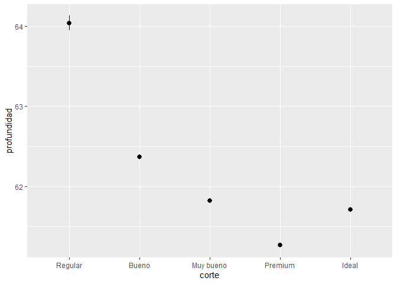
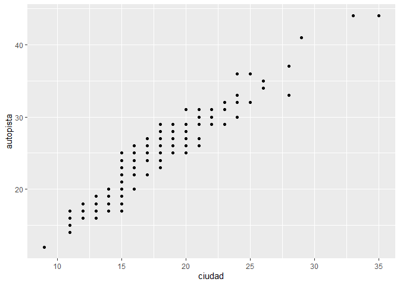
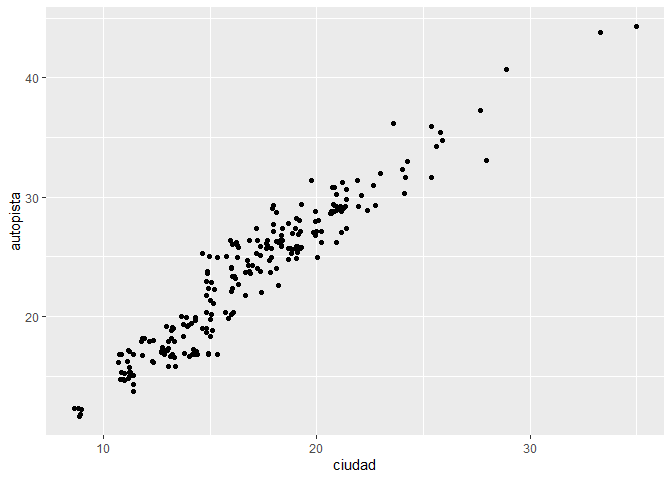
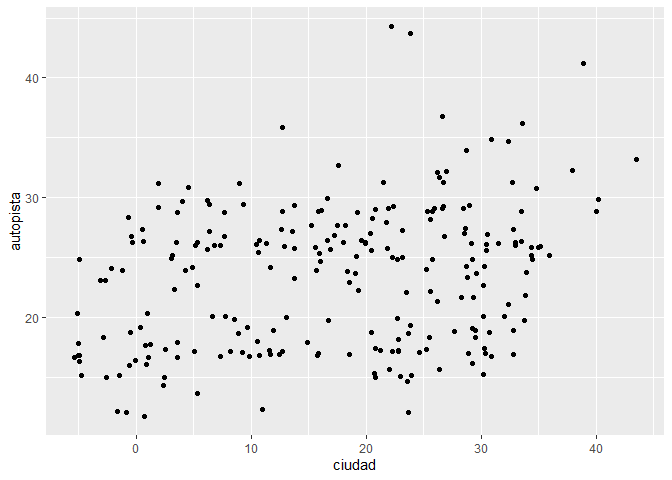
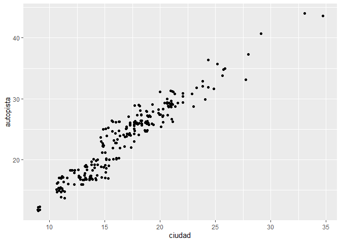
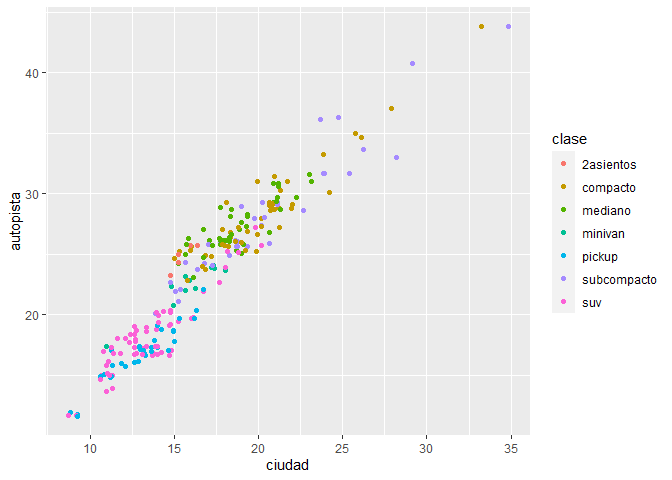

Tarea 4 \[Actividad grupal\]: ggplot
================
Diego Morante & Benjy Velasquez
21/1/2022

## 10 Ejercicios: ggplot2: Cargar la data millas del paquete datos

``` r
library(tidyverse)
```

    ## -- Attaching packages --------------------------------------- tidyverse 1.3.1 --

    ## v ggplot2 3.3.5     v purrr   0.3.4
    ## v tibble  3.1.6     v dplyr   1.0.7
    ## v tidyr   1.1.4     v stringr 1.4.0
    ## v readr   2.1.1     v forcats 0.5.1

    ## -- Conflicts ------------------------------------------ tidyverse_conflicts() --
    ## x dplyr::filter() masks stats::filter()
    ## x dplyr::lag()    masks stats::lag()

``` r
library(datos)
view(millas)
```

# 10.1 Parte 1: Ggplot base

Ejecuta ggplot(data = millas). ¿Qué observas?

``` r
ggplot(data = millas) # Un plot con fondo gris, sin ningún gráfico
```

<!-- -->

¿Cuántas filas hay en millas? ¿Cuántas columnas?

``` r
nrow(millas)
```

    ## [1] 234

``` r
ncol(millas)
```

    ## [1] 11

``` r
  # Hay 234 filas y 11 columnas
```

¿Qué describe la variable traccion? Lee la ayuda de ?millas para
encontrar la respuesta.

``` r
?millas
```

    ## starting httpd help server ... done

``` r
  ## (d = delantera, t = trasera, 4 = 4 ruedas)
```

Realiza un gráfico de dispersión de autopista versus cilindros.

``` r
ggplot(millas, aes(x = autopista, y = cilindros)) +
  geom_point()
```

<!-- -->

¿Qué sucede cuando haces un gráfico de dispersión (scatterplot) de clase
versus traccion? ¿Por qué no es útil este gráfico?

``` r
ggplot(millas, aes(x = clase, y = traccion)) +
  geom_point()
```

<!-- -->

``` r
  # tiene pocos elementos
count(millas, traccion, clase)
```

    ## # A tibble: 12 x 3
    ##    traccion clase           n
    ##    <chr>    <chr>       <int>
    ##  1 4        compacto       12
    ##  2 4        mediano         3
    ##  3 4        pickup         33
    ##  4 4        subcompacto     4
    ##  5 4        suv            51
    ##  6 d        compacto       35
    ##  7 d        mediano        38
    ##  8 d        minivan        11
    ##  9 d        subcompacto    22
    ## 10 t        2asientos       5
    ## 11 t        subcompacto     9
    ## 12 t        suv            11

``` r
  # el grafico de puntos esta dirigido para el uso de variables continuas y no tan repetidas como nos muestra el comando count(millas, traccion, clase)
```

10.2 Parte 2: Mapeos estéticos ¿Qué no va bien en este código? ¿Por qué
hay puntos que no son azules?

``` r
ggplot(data = millas) + 
  geom_point(mapping = aes(x = cilindrada, y = autopista, color = "blue"))
```

<!-- -->

``` r
  ## Se leen como color rojo porque el parametro de color se encuentra dentro del asignamiento de ejes

ggplot(millas, aes(x = cilindrada, y = autopista, colour = ciudad)) +
  geom_point()
```

<!-- -->

Asigna una variable continua a color, size, y shape. ¿Cómo se comportan
estas estéticas de manera diferente para variables categóricas y
variables continuas?

``` r
  # cilindrada es una variable continua
ggplot(millas, aes(x = cilindrada, y = autopista, colour = autopista, size = autopista)) +
  geom_point(shape = 24)
```

<!-- -->

¿Qué ocurre si asignas o mapeas la misma variable a múltiples estéticas?

``` r
ggplot(millas, aes(x = cilindrada, y = ciudad, colour = ciudad, size = ciudad)) +
  geom_point()
```

<!-- -->

¿Qué hace la estética stroke? ¿Con qué formas trabaja? (Pista: consulta
?geom_point)

``` r
ggplot(mtautos, aes(peso, millas)) +
  geom_point(shape = 21, colour = "black", fill = "white", size = 5, stroke = 1)
```

<!-- -->

``` r
  ## Modifica el grosor del borde del shape
```

¿Qué ocurre si se asigna o mapea una estética a algo diferente del
nombre de una variable, como aes(color = cilindrada \< 5)?

``` r
ggplot(millas, aes(x = cilindrada, y = autopista, colour = cilindrada < 5)) +
  geom_point()
```

<!-- -->

``` r
 # Crea un margen en el eje x = 5 que divide en 2 colores 
```

# 10.3 Parte 3: Facetas

¿Qué ocurre si intentas separar en facetas una variable continua?

``` r
ggplot(millas, aes(x = cilindrada, y = autopista)) +
  geom_point() +
  facet_grid(. ~ ciudad)
```

<!-- -->

``` r
  ## La variable cilindrada toma forma facetas con respecto a numeros enteros,
```

¿Qué significan las celdas vacías que aparecen en el gráfico generado
usando facet_grid(traccion \~ cilindros)? ¿Cómo se relacionan con este
gráfico?

``` r
ggplot(data = millas) +
  geom_point(mapping = aes(x = traccion, y = cilindros))
```

<!-- -->

``` r
 # Al ser variable de numeros enteros las facetas no llegan a llenarse, sino a tener valores en sus margenes
```

¿Qué grafica el siguiente código? ¿Qué hace . ?

``` r
  ggplot(data = millas) +
  geom_point(mapping = aes(x = cilindrada, y = autopista)) +
  facet_grid(traccion ~ .)
```

<!-- -->

``` r
ggplot(data = millas) +
  geom_point(mapping = aes(x = cilindrada, y = autopista)) +
  facet_grid(. ~ cilindros)
```

<!-- -->

``` r
 ## grafica de dispersion con facetas en forma de filas y columnas, esto se debe a la posicion del ( ~ .) o (. ~) en el comando facet_grid()
```

Mira de nuevo el primer gráfico en facetas presentado en esta sección:

``` r
ggplot(data = millas) +
  geom_point(mapping = aes(x = cilindrada, y = autopista)) +
  facet_wrap(~ clase, nrow = 2)
```

<!-- -->

¿Cuáles son las ventajas de separar en facetas en lugar de aplicar una
estética de color? ¿Cuáles son las desventajas? ¿Cómo cambiaría este
balance si tuvieras un conjunto de datos más grande? - Lee ?facet_wrap.
¿Qué hace nrow? ¿Qué hace ncol? ¿Qué otras opciones controlan el diseño
de los paneles individuales? ¿Por qué facet_grid() no tiene argumentos
nrow y ncol? - Cuando usas facet_grid(), generalmente deberías poner la
variable con un mayor número de niveles únicos en las columnas. ¿Por
qué?

10.4 Parte 4: Objetos geométricos ¿Qué geom usarías para generar un
gráfico de líneas? ¿Y para un diagrama de caja? ¿Y para un histograma?
¿Y para un gráfico de área?

``` r
geom_line()
```

    ## geom_line: na.rm = FALSE, orientation = NA
    ## stat_identity: na.rm = FALSE
    ## position_identity

``` r
geom_boxplot()
```

    ## geom_boxplot: outlier.colour = NULL, outlier.fill = NULL, outlier.shape = 19, outlier.size = 1.5, outlier.stroke = 0.5, outlier.alpha = NULL, notch = FALSE, notchwidth = 0.5, varwidth = FALSE, na.rm = FALSE, orientation = NA
    ## stat_boxplot: na.rm = FALSE, orientation = NA
    ## position_dodge2

``` r
geom_histogram()
```

    ## geom_bar: na.rm = FALSE, orientation = NA
    ## stat_bin: binwidth = NULL, bins = NULL, na.rm = FALSE, orientation = NA, pad = FALSE
    ## position_stack

``` r
geom_area()
```

    ## geom_area: na.rm = FALSE, orientation = NA, outline.type = upper
    ## stat_identity: na.rm = FALSE
    ## position_stack

Ejecuta este código en tu mente y predice cómo se verá el output. Luego,
ejecuta el código en R y verifica tus predicciones.

``` r
ggplot(data = millas, mapping = aes(x = cilindrada, y = autopista, color = traccion)) +
  geom_point() +
  geom_smooth(se = FALSE)
```

    ## `geom_smooth()` using method = 'loess' and formula 'y ~ x'

<!-- -->

¿Qué muestra show.legend = FALSE? ¿Qué pasa si lo quitas? ¿Por qué crees
que lo utilizamos antes en el capítulo?

``` r
# Sin leyenda:
ggplot(data = millas) +
  geom_smooth(
    mapping = aes(x = cilindrada, y = autopista, colour = traccion),
    show.legend = FALSE)
```

    ## `geom_smooth()` using method = 'loess' and formula 'y ~ x'

<!-- -->

``` r
# Con leyenda:
ggplot(data = millas) +
  geom_smooth(
    mapping = aes(x = cilindrada, y = autopista, colour = traccion),
    show.legend = TRUE
  )
```

    ## `geom_smooth()` using method = 'loess' and formula 'y ~ x'

<!-- -->

¿Qué hace el argumento se en geom_smooth()?

``` r
ggplot(data = millas, mapping = aes(x = cilindrada, y = autopista, colour = traccion)) +
  geom_point() +
  geom_smooth(se = TRUE) #agrega el sombreado en las bandas de error
```

    ## `geom_smooth()` using method = 'loess' and formula 'y ~ x'

<!-- -->

¿Se verán distintos estos gráficos? ¿Por qué sí o por qué no?

``` r
ggplot(data = millas, mapping = aes(x = cilindrada, y = autopista)) +
  geom_point() +
  geom_smooth()
```

    ## `geom_smooth()` using method = 'loess' and formula 'y ~ x'

<!-- -->

``` r
ggplot() +
  geom_point(data = millas, mapping = aes(x = cilindrada, y = autopista)) +
  geom_smooth(data = millas, mapping = aes(x = cilindrada, y = autopista))
```

    ## `geom_smooth()` using method = 'loess' and formula 'y ~ x'

<!-- -->

``` r
# la diferencia esta en como llamar los parametros.
```

Recrea el código R necesario para generar los siguientes gráficos:

``` r
# Gráfico 1
ggplot(data = millas, mapping = aes(x = cilindrada, y = autopista)) +
  geom_point() +
  geom_smooth(se = FALSE)
```

    ## `geom_smooth()` using method = 'loess' and formula 'y ~ x'

<!-- -->

``` r
# Gráfico 2

ggplot(data = millas, mapping = aes(x = cilindrada, y = autopista)) +
  geom_smooth(aes(group = traccion), se = FALSE) +
  geom_point()
```

    ## `geom_smooth()` using method = 'loess' and formula 'y ~ x'

<!-- -->

``` r
# Gráfico 3

ggplot(data = millas, mapping = aes(x = cilindrada, y = autopista, color = traccion)) +
  geom_point() +
  geom_smooth(se = FALSE)
```

    ## `geom_smooth()` using method = 'loess' and formula 'y ~ x'

<!-- -->

``` r
# Gráfico 4

ggplot(data = millas, mapping = aes(x = cilindrada, y = autopista)) +
  geom_point(aes(color = traccion)) +
  geom_smooth(se = FALSE)
```

    ## `geom_smooth()` using method = 'loess' and formula 'y ~ x'

<!-- -->

``` r
# Gráfico 5

ggplot(data = millas, mapping = aes(x = cilindrada, y = autopista)) +
  geom_point(aes(color = traccion)) +
  geom_smooth(aes(linetype = traccion), se = FALSE)
```

    ## `geom_smooth()` using method = 'loess' and formula 'y ~ x'

<!-- -->

``` r
# Gráfico 6

ggplot(data = millas, mapping = aes(x = cilindrada, y = autopista)) +
  geom_point(size = 5, colour = "white") +
  geom_point(aes(colour = traccion))
```

<!-- -->

10.5 Parte 5: Gráficos estadísticos ¿Cuál es el geom predeterminado
asociado con stat_summary()? ¿Cómo podrías reescribir el gráfico
anterior para usar esa función geom en lugar de la función stat?

``` r
ggplot(data = diamantes) +
  stat_summary(
    mapping = aes(x = corte, y = profundidad),
    fun.ymin = min,
    fun.ymax = max,
    fun.y = median
  )
```

    ## Warning: `fun.y` is deprecated. Use `fun` instead.

    ## Warning: `fun.ymin` is deprecated. Use `fun.min` instead.

    ## Warning: `fun.ymax` is deprecated. Use `fun.max` instead.

<!-- -->

La geometría por defecto para stat_summary() es geom_pointrange().

El estadístico por defecto para geom_pointrange() es identity() pero se
puede incluir el argumento stat = “summary” para usar stat_summary() en
lugar de stat_identity().

``` r
ggplot(data = diamantes) +
  geom_pointrange(
    mapping = aes(x = corte, y = profundidad),
    stat = "summary"
  )
```

    ## No summary function supplied, defaulting to `mean_se()`

<!-- -->

El mensaje resultante en stat_summary() indica que se usó mean y sd para
calcular el centro y los extremos de la línea. Sin embargo, en el
gráfico original se usaron el máximo y mínimo para los extremos.

Para recrear el gráfico original hay que especificar los valores de
fun.ymin, fun.ymax, y fun.y.

``` r
ggplot(data = diamantes) +
  geom_pointrange(
    mapping = aes(x = corte, y = profundidad),
    stat = "summary",
    fun.ymin = min,
    fun.ymax = max,
    fun.y = median
  )
```

    ## Warning: Ignoring unknown parameters: fun.ymin, fun.ymax, fun.y

    ## No summary function supplied, defaulting to `mean_se()`

<!-- -->

¿Qué hace geom_col()? ¿En qué se diferencia de geom_bar()?

El estadístico por defecto en geom_col() es distinto de geom_bar().

geom_col() usa stat_identity(), que deja los datos sin transformar.

geom_col() espera que los datos contengan los valores de x y los valores
de y que representan la altura de las columnas.

geom_bar() usa stat_bin() y espera únicamente los valores de x.

stat_bin(), procesa los datos de entrada y realiza un conteo del número
de observaciones para cada valor de x, lo cual genera la variable y
internamente.

# La mayoría de los geoms y las transformaciones estadísticas vienen en pares que casi siempre se usan en conjunto. Lee la documentación y haz una lista de todos los pares. ¿Qué tienen en común?

Las siguiente tabla contienen los pares entre geometrías y estadísticos
que se usan en conjunto.

| geometría           | estadístico         |
|---------------------|---------------------|
| `geom_bar()`        | `stat_count()`      |
| `geom_bin2d()`      | `stat_bin_2d()`     |
| `geom_boxplot()`    | `stat_boxplot()`    |
| `geom_contour()`    | `stat_contour()`    |
| `geom_count()`      | `stat_sum()`        |
| `geom_density()`    | `stat_density()`    |
| `geom_density_2d()` | `stat_density_2d()` |
| `geom_hex()`        | `stat_hex()`        |
| `geom_freqpoly()`   | `stat_bin()`        |
| `geom_histogram()`  | `stat_bin()`        |
| `geom_qq_line()`    | `stat_qq_line()`    |
| `geom_qq()`         | `stat_qq()`         |
| `geom_quantile()`   | `stat_quantile()`   |
| `geom_smooth()`     | `stat_smooth()`     |
| `geom_violin()`     | `stat_violin()`     |
| `geom_sf()`         | `stat_sf()`         |

Tabla: Geometrías y estadísticos complementarios

Los nombres tienen a ser similares, por ejemplo `geom_smooth()` y
`stat_smooth()`, aunque hay casos como `geom_bar()` y `stat_count()`.

La mayoría de las geometrías usa por defecto el estadístico que le
corresponde en la tabla anterior. Recíprocamente, la mayoría de los
estadísticos usan por defecto la geometría que le corresponde en la
tabla anterior.

Las siguientes tablas contienen las geometrías y estadísticos en
[ggplot2](https://ggplot2.tidyverse.org/reference/).

| geometría           | estadístico por defecto | documentación conjunta |
|:--------------------|:------------------------|------------------------|
| `geom_abline()`     |                         |                        |
| `geom_hline()`      |                         |                        |
| `geom_vline()`      |                         |                        |
| `geom_bar()`        | `stat_count()`          | x                      |
| `geom_col()`        |                         |                        |
| `geom_bin2d()`      | `stat_bin_2d()`         | x                      |
| `geom_blank()`      |                         |                        |
| `geom_boxplot()`    | `stat_boxplot()`        | x                      |
| `geom_countour()`   | `stat_countour()`       | x                      |
| `geom_count()`      | `stat_sum()`            | x                      |
| `geom_density()`    | `stat_density()`        | x                      |
| `geom_density_2d()` | `stat_density_2d()`     | x                      |
| `geom_dotplot()`    |                         |                        |
| `geom_errorbarh()`  |                         |                        |
| `geom_hex()`        | `stat_hex()`            | x                      |
| `geom_freqpoly()`   | `stat_bin()`            | x                      |
| `geom_histogram()`  | `stat_bin()`            | x                      |
| `geom_crossbar()`   |                         |                        |
| `geom_errorbar()`   |                         |                        |
| `geom_linerange()`  |                         |                        |
| `geom_pointrange()` |                         |                        |
| `geom_map()`        |                         |                        |
| `geom_point()`      |                         |                        |
| `geom_map()`        |                         |                        |
| `geom_path()`       |                         |                        |
| `geom_line()`       |                         |                        |
| `geom_step()`       |                         |                        |
| `geom_point()`      |                         |                        |
| `geom_polygon()`    |                         |                        |
| `geom_qq_line()`    | `stat_qq_line()`        | x                      |
| `geom_qq()`         | `stat_qq()`             | x                      |
| `geom_quantile()`   | `stat_quantile()`       | x                      |
| `geom_ribbon()`     |                         |                        |
| `geom_area()`       |                         |                        |
| `geom_rug()`        |                         |                        |
| `geom_smooth()`     | `stat_smooth()`         | x                      |
| `geom_spoke()`      |                         |                        |
| `geom_label()`      |                         |                        |
| `geom_text()`       |                         |                        |
| `geom_raster()`     |                         |                        |
| `geom_rect()`       |                         |                        |
| `geom_tile()`       |                         |                        |
| `geom_violin()`     | `stat_ydensity()`       | x                      |
| `geom_sf()`         | `stat_sf()`             | x                      |

Tabla: ggplot2 capas de geometrías y sus estadísticos por defecto.

| estadístico          | geometría por defecto | documentación conjunta |
|:---------------------|:----------------------|------------------------|
| `stat_ecdf()`        | `geom_step()`         |                        |
| `stat_ellipse()`     | `geom_path()`         |                        |
| `stat_function()`    | `geom_path()`         |                        |
| `stat_identity()`    | `geom_point()`        |                        |
| `stat_summary_2d()`  | `geom_tile()`         |                        |
| `stat_summary_hex()` | `geom_hex()`          |                        |
| `stat_summary_bin()` | `geom_pointrange()`   |                        |
| `stat_summary()`     | `geom_pointrange()`   |                        |
| `stat_unique()`      | `geom_point()`        |                        |
| `stat_count()`       | `geom_bar()`          | x                      |
| `stat_bin_2d()`      | `geom_tile()`         | x                      |
| `stat_boxplot()`     | `geom_boxplot()`      | x                      |
| `stat_countour()`    | `geom_contour()`      | x                      |
| `stat_sum()`         | `geom_point()`        | x                      |
| `stat_density()`     | `geom_area()`         | x                      |
| `stat_density_2d()`  | `geom_density_2d()`   | x                      |
| `stat_bin_hex()`     | `geom_hex()`          | x                      |
| `stat_bin()`         | `geom_bar()`          | x                      |
| `stat_qq_line()`     | `geom_path()`         | x                      |
| `stat_qq()`          | `geom_point()`        | x                      |
| `stat_quantile()`    | `geom_quantile()`     | x                      |
| `stat_smooth()`      | `geom_smooth()`       | x                      |
| `stat_ydensity()`    | `geom_violin()`       | x                      |
| `stat_sf()`          | `geom_rect()`         | x                      |

Tabla: ggplot2 capas de estadísticos y sus geometrías por defecto.

¿Qué variables calcula stat_smooth()? ¿Qué parámetros controlan su
comportamiento?

La función `stat_smooth()` calcula las siguientes variables:

-   `y`: valor predicho
-   `ymin`: menor valor del intervalo de confianza
-   `ymax`: mayor valor del intervalo de confianza
-   `se`: error estándar

La sección “Computed Variables” en la documentación de `stat_smooth()`
contiene estas variables.

Los parámetros que controlan `stat_smooth()` incluyen

-   `method`: cuál método utilizar
-   `formula`: las fórmulas, al igual que `method`, determinan cómo se
    hará el cálculo del intervalo de confianza y los argumentos
    adicionales que se requieran.
-   `na.rm`: si acaso se eliminarán los casos perdidos

En nuestro gráfico de barras de proporción necesitamos establecer group
= 1. ¿Por qué? En otras palabras, ¿cuál es el problema con estos dos
gráficos?

10.6 Ajustes de posicion {-#ajustes-posicion}

¿Cual es el problema con este grafico?¿Como podrias mejorarlo?

``` r
ggplot(data = millas, mapping = aes(x = ciudad, y = autopista)) +
geom_point()
```

<!-- --> Existe
superposicion ya que hay multiples observaciones para cada combinacion
de `ciudad` y `autopista`. Se puede mejorar el grafico usando el
argumento de distorsion y asi reducir la superposicion.

``` r
ggplot(data = millas, mapping = aes(x = ciudad, y = autopista)) +
  geom_point(position = "jitter")
```

<!-- --> La relacion
entre `ciudad` y `autopista` es clara, incluso sin el argumento de
distorsion, que en este caso deja en claro donde se concentran las
observaciones.

¿Que parametros de `geom_jitter()` controlan la cantidad de ruido? A
partir de la documentacion de
[`geom_jitter()`](https://ggplot2.tidyverse.org/reference/geom_jitter.html),
existen dos argumentos:

-   `width` controla el desplazamiento vertical
-   `height` controla el desplazamiento horizontal

Los valores por defecto de `width` y `height` introducen ruido en ambas
direcciones.

Asi se ve el grafico con las opciones por defecto.

``` r
ggplot(data = millas, mapping = aes(x = ciudad, y = autopista)) +
  geom_point(position = position_jitter())
```

<!-- -->

Con `width = 0` se elimina la distorsion horizontal.

``` r
ggplot(data = millas, mapping = aes(x = ciudad, y = autopista)) +
  geom_jitter(width = 0)
```

<!-- -->

Con `width = 20` se agrega mucha distorsion.

``` r
ggplot(data = millas, mapping = aes(x = ciudad, y = autopista)) +
  geom_jitter(width = 20)
```

<!-- -->

Es analogo para `height`.

Hay que notar que `width` y `height` se expresan en las mismas unidades
que los datos, por lo que `height = 1` o `width = 1` corresponden a
diferentes valores relativos de distorsión dependiendo de las escalas
de `x` e `y`.

Los valores por defecto son 80% de la resolucion (`resolution()`) de los
datos. Cuando `x` e `y` son discretas, su resolucion es igual a uno, y
los valores por defecto son `height = 0.4` y `width = 0.4` ya que la
distorsion mueve los puntos en direccion positiva y negativa.

Compara y contrasta `geom_jitter()` con `geom_count()` `geom_jitter()`
agrega una variacion al azar a los puntos del grafico, es decir que
distorsiona la ubicacion de los puntos en el grafico. Este metodo reduce
la superposicion ya que es poco probable que al mover los puntos al azar
estos queden en la misma ubicacion. Sin embargo, el problema de reducir
la superposicion es que se distorsionan los valores mostrados de `x` e
`y`.

``` r
ggplot(data = millas, mapping = aes(x = ciudad, y = autopista)) +
  geom_jitter()
```

<!-- -->

`geom_count()` cambia el tamaño de los puntos relativo a la cantidad
de observaciones. Las combinaciones de `x` e `y` con mas observaciones
tendran un mayor tamaño. Esto no distorsiona los valores, pero tiene el
problema de que el tamaño de los puntos puede generar superposicion si
los puntos son cercanos.

``` r
ggplot(data = millas, mapping = aes(x = ciudad, y = autopista)) +
  geom_count()
```

<!-- -->

Por ejemplo, `geom_count()` puede ser menos legible que `geom_jitter()`
si se agrega un argumento de color.

``` r
ggplot(data = millas, mapping = aes(x = ciudad, y = autopista, color = clase)) +
  geom_jitter()
```

<!-- -->

``` r
ggplot(data = millas, mapping = aes(x = ciudad, y = autopista, color = clase)) +
  geom_count()
```

<!-- -->

Este ejemplo muestra que no existe una solucion universal. El coste y
beneficio de cada enfoque depende de la estructura de los datos y del
objetivo.

¿Cual es el ajuste de posicion predeterminado de `geom_boxplot()`? Crea
una visualizacion del conjunto de datos de `millas` que lo demuestre.

La posicion por defecto para `geom_boxplot()` es `"dodge2"`, que es un
atajo de `position_dodge2`.

Este ajuste no cambia la posicion vertical pero mueve las geometrias
horizontalmente para evitar la superposicion.

Consulta la documentacion de
[`position_dodge2()`](https://ggplot2.tidyverse.org/reference/position_dodge.html)
para los detalles especificos.

Si agregamos `colour = clase` a un diagrama de cajas, los niveles de
`transmision` se ubican lado a lado.

``` r
ggplot(data = millas, aes(x = transmision, y = autopista, colour = clase)) +
  geom_boxplot()
```

<!-- -->

Si se usa `position_identity()` habra superposicion.

``` r
ggplot(data = millas, aes(x = transmision, y = autopista, colour = clase)) +
  geom_boxplot(position = "identity")
```

<!-- -->

# 10.7 Sistemas de coordenadas

Convierte un grafico de barras apiladas en un grafico circular usando
`coord_polar()`.

Un grafico de torta es un grafico de barras aplicadas con la adicion de
coordenadas polares.

Partamos del siguiente ejemplo:

``` r
ggplot(millas, aes(x = factor(1), fill = traccion)) +
geom_bar()
```

<!-- -->

Ahora agregamos `coord_polar(theta="y")` para crear el grafico de torta:

``` r
ggplot(millas, aes(x = factor(1), fill = traccion)) +
geom_bar(width = 1) +
coord_polar(theta = "y")
```

<!-- -->

El argumento `theta = "y"` transforma `y` en el angulo de cada seccion.
Si `coord_polar()` se especifica sin `theta = "y"`, el resultado se
llama “ojo de buey”.

``` r
ggplot(millas, aes(x = factor(1), fill = traccion)) +
  geom_bar(width = 1) +
  coord_polar()
```

<!-- -->

¿Que hace `labs()`? Lee la documentacion. `labs` agrega los titulos de
los ejes, titulo del grafico y la leyenda.

``` r
ggplot(data = millas, mapping = aes(x = clase, y = autopista)) +
  geom_boxplot() +
  coord_flip() +
  labs(y = "Millas por Galón en Autopista",
       x = "Clase",
       title = "Millas por Galón en Autopista por Tipo de Vehículo",
       subtitle = "1999-2008",
       caption = "Fuente: http://fueleconomy.gov")
```

<!-- -->

`labs()` no es la unica funcion para agregar titulos. `xlab()`, `ylab()`
y `ggtitle()` realizan la misma funcion.

¿Cual es la diferencia entre `coord_quickmap()` y `coord_map()`?
`coord_map()` usa una proyeccion cartografica para proyectar la Tierra
sobre una superficie bidimensional. Por defecto usa la [Proyeccion de
Mercator](https://es.wikipedia.org/wiki/Proyecci%C3%B3n_de_Mercator), la
cual se aplica a todas las geometrias del grafico.

`coord_quickmap()` usa una aproximacion mas rapida que ignora la
curvatura de la tierra y ajusta de acuerdo a la razon de latitud y
longitud. Esta es una alternativa computacionalmente mas rapida que no
genera la necesidad de transformar las geometrias individuales.

Consulta
[coord_map()](https://ggplot2.tidyverse.org/reference/coord_map.html)
para la documentacion y ejemplos.

¿Que te dice la grafica siguiente sobre la relacion entre la ciudad y la
`autopista`?¿Por que es `coord_fixed()` importante?¿Que hace
`geom_abline()`?

``` r
ggplot(data = millas, mapping = aes(x = ciudad, y = autopista)) +
geom_point() +
geom_abline() +
coord_fixed()
```


La funcion `coord_fixed()` asegura que la linea que genera
`geom_abline()` tenga un angulo de 45 grados. De este modo es mas facil
comparar a partir de los casos en que los rendimientos en autopista y
ciudad son iguales.

``` r
ggplot(data = millas, mapping = aes(x = ciudad, y = autopista)) +
  geom_point() +
  geom_abline() +
  coord_fixed()
```

<!-- -->

Lo que podemos ver es que en todos los modelos el rendimiento en
autopista es superior al rendmiento en ciudad.
